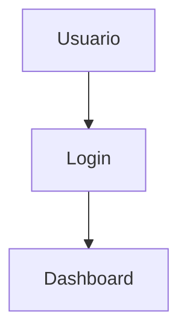

# 📋 Sistema de Gestión ISSEG

**Sistema integral de gestión de solicitudes, modificaciones y problemas** para sistemas informáticos institucionales.

**Versión:** 2.0  
**Fecha:** Febrero 2026  
**Estado:** Documentación Completa

---

## 🌐 Visualización Web

**¡Nuevo!** Este repositorio ahora puede visualizarse como un sitio web interactivo:

- 🔗 **Acceso Web:** Activa GitHub Pages para ver el sitio en `https://<tu-usuario>.github.io/trabajo-isseg/`
- 📱 **Responsive:** Funciona en móviles, tablets y escritorio
- 🎨 **Interfaz Moderna:** Navegación intuitiva con diseño profesional
- 📋 **Formularios Interactivos:** Visualiza los 4 formularios del sistema
- 🔄 **Diagramas Dinámicos:** Explora los flujos con Mermaid.js

👉 **Ver guía completa:** [GUIA-WEB-SERVICE.md](GUIA-WEB-SERVICE.md)

---

## 📖 Tabla de Contenidos

- [Visualización Web](#-visualización-web)
- [Acerca del Proyecto](#-acerca-del-proyecto)
- [Razones del Proyecto](#-razones-del-proyecto)
- [Estructura de Documentación](#-estructura-de-documentación)
- [Cómo Visualizar los Diagramas](#-cómo-visualizar-los-diagramas)
- [Características Principales](#-características-principales)
- [Formularios del Sistema](#-formularios-del-sistema)
- [Guía Rápida de Navegación](#-guía-rápida-de-navegación)

---

## 🎯 Acerca del Proyecto

El **Sistema ISSEG** es una plataforma centralizada diseñada para gestionar de manera eficiente todas las solicitudes relacionadas con sistemas informáticos de la organización, incluyendo:

- ✅ **Solicitudes de nuevos sistemas**
- ✅ **Modificaciones a sistemas existentes**
- ✅ **Reportes de problemas e incidencias**
- ✅ **Seguimiento y aprobaciones**
- ✅ **Control de acceso por áreas**
- ✅ **Auditoría completa de operaciones**

### Objetivos del Sistema

1. **Centralizar** todas las solicitudes en un solo lugar
2. **Estandarizar** los procesos de solicitud y aprobación
3. **Automatizar** el seguimiento con SLA (Service Level Agreement)
4. **Auditar** todos los cambios y decisiones
5. **Mejorar** los tiempos de respuesta y resolución

---

## 🚨 Razones del Proyecto

### Problemática Actual (ANTES del sistema)

El proyecto ISSEG nace para resolver problemas críticos en la gestión de sistemas:

| ❌ Problema | 💥 Impacto |
|------------|-----------|
| **Solicitudes por email/llamadas** | Pérdida de información, trabajo duplicado |
| **Sin registro centralizado** | No hay trazabilidad de solicitudes |
| **Solicitudes perdidas** | Usuarios frustrados, proyectos retrasados |
| **Sin seguimiento de tiempos (SLA)** | Incumplimiento de plazos comprometidos |
| **Difícil priorizar urgencias** | Proyectos importantes retrasados |
| **Sin historial de cambios** | Se repiten los mismos problemas |
| **Aprobaciones verbales** | Riesgos de cumplimiento y legales |
| **Falta de documentación técnica** | Dependencia de personas clave |

### Solución Propuesta (DESPUÉS del sistema)

✅ **Solicitudes controladas** con formularios estandarizados  
✅ **SLA automático** con alertas y seguimiento en tiempo real  
✅ **Dashboard ejecutivo** para visibilidad completa  
✅ **Control de acceso por áreas** para seguridad  
✅ **Historial completo** de todas las operaciones  
✅ **Integración con herramientas** existentes

---

## 📂 Estructura de Documentación

El proyecto está organizado en las siguientes carpetas:

```
trabajo-isseg/
│
├── 📄 README.md                              ← Estás aquí
├── 📄 Presentacion-Sistema-ISSEG.md          ← Presentación ejecutiva completa
├── 📄 Visualizacion-Formularios-Flujos.html  ← Vista interactiva de formularios
│
├── 📁 docmentacion/                          ← Documentación técnica detallada
│   ├── 00-LEEME-PRIMERO.md                   ← Punto de entrada principal
│   ├── 01-diagrama-flujo-tickets.md          ← Flujos de proceso
│   ├── 02-formularios-estructurados.md       ← Especificación formularios
│   ├── 03-dashboard-inventario-proyectos.md  ← Dashboard y métricas
│   ├── 04-control-usuarios-bd.md             ← Control de acceso y usuarios
│   ├── 05-modulo-autenticacion-tecnico.md    ← Autenticación técnica
│   ├── 06-resumen-ejecutivo.md               ← Resumen ejecutivo
│   ├── 07-diagramas-control-acceso.md        ← Diagramas de seguridad
│   ├── 08-indice-navegacion.md               ← Índice navegable
│   ├── 09-matriz-implementacion.md           ← Plan de implementación
│   ├── 10-tablas-registros-control.md        ← Estructura de base de datos
│   ├── 11-diagrama-er-tablas.md              ← Modelo entidad-relación
│   ├── 12-flujos-integrados-completos.md     ← Flujos completos integrados
│   ├── COMPLETADO-V2.0.md                    ← Resumen de completitud
│   ├── INDICE-ACTUALIZADO.md                 ← Índice actualizado
│   ├── README.md                             ← Resumen de documentación
│   └── RESUMEN-ACTUALIZACIONES.md            ← Historial de cambios
│
├── 📁 formularios/                           ← Formularios HTML y documentación
│   ├── 01-Formulario-Sistema-Nuevo.html
│   ├── 02-Formulario-Modificacion.html
│   ├── 03-Formulario-Requerimientos.html
│   ├── 04-Formulario-Problema.html
│   ├── Formulario-Sistema-Nuevo.md
│   ├── Formulario-Modificacion.md
│   ├── Formulario-Requerimientos.md
│   ├── Formulario-Problema.md
│   ├── INDEX.html                            ← Índice de formularios
│   └── README-Formularios.md
│
└── 📁 diagramas/                             ← Diagramas Mermaid (.mmd)
    ├── 1. Diagrama de Autenticación y Control de Acceso.mmd
    ├── 2. Diagrama de Validación de Permisos de Área.mmd
    ├── 3. Diagrama de Proceso Principal con Control de Acceso.mmd
    ├── 4. Diagrama de Filtrado de Sistemas por Área.mmd
    ├── 5. Diagrama de Estructura de Control de Usuarios.mmd
    ├── 6. Tabla de Permisos por Rol y Área.mmd
    ├── 7. Diagrama de Control y Registro en Base de Datos.mmd
    ├── 8. Diagrama de Estados del Ticket.mmd
    ├── diseño general de todo.mmd
    └── extra.mmd
```

---

## 🎨 Cómo Visualizar los Diagramas

Este proyecto contiene **35+ diagramas Mermaid** que documentan flujos, arquitectura y estructuras de datos.

### 📦 Extensión Requerida para VS Code

Para visualizar los diagramas Mermaid (archivos `.mmd` y bloques en Markdown), necesitas instalar la extensión oficial de Mermaid:

#### Mermaid Preview

**Nombre:** `Mermaid Preview`  
**ID:** `vstirbu.vscode-mermaid-preview`  
**Autor:** Vlad Stirbu

**📥 Instalación:**
```
1. Abre Visual Studio Code
2. Ve a Extensiones (Ctrl+Shift+X)
3. Busca: "Mermaid Preview"
4. Haz clic en "Instalar"
5. Reinicia VS Code si es necesario
```

**✨ Uso:**

**Para archivos .mmd:**
- Abre cualquier archivo `.mmd` de la carpeta `diagramas/`
- Haz clic derecho en el editor
- Selecciona **"Open Preview to the Side"**
- El diagrama se renderizará en tiempo real

**Para diagramas en archivos .md:**
- Abre cualquier archivo de documentación con bloques Mermaid
- Usa el atajo: `Ctrl+Shift+P` (Windows/Linux) o `Cmd+Shift+P` (Mac)
- Escribe: **"Mermaid: Preview"**
- El diagrama se mostrará en un panel lateral

**Ejemplo de diagrama embebido:**

````markdown

````

**⚡ Características:**
- ✅ Renderizado en tiempo real
- ✅ Soporte para todos los tipos de diagramas Mermaid
- ✅ Exportación a PNG/SVG
- ✅ Zoom y navegación
- ✅ Actualización automática al editar

---

## ⚡ Características Principales

### 🔐 Control de Acceso Avanzado

- **Autenticación segura** con hash de contraseñas
- **Control de acceso por áreas** (solo usuarios autorizados)
- **Roles y permisos granulares** por usuario y área
- **Auditoría completa** de accesos y operaciones
- **Bloqueo automático** tras intentos fallidos

### 📊 Dashboard Ejecutivo

- **Vista consolidada** de todas las solicitudes
- **KPIs en tiempo real** (pendientes, en proceso, completados)
- **Filtros avanzados** por área, tipo, urgencia, estado
- **Gráficos de rendimiento** por área y período
- **Alertas SLA** para solicitudes próximas a vencer

### 📝 Sistema de Formularios

- **4 formularios especializados** según tipo de solicitud
- **Validaciones automáticas** de campos obligatorios
- **Campos dinámicos** según contexto
- **Adjuntos de archivos** (documentos técnicos)
- **Versionado de cambios** en modificaciones

### 🔄 Workflow Automatizado

- **Asignación automática** según área y tipo
- **Notificaciones por email** en cada cambio de estado
- **Escalamiento automático** si se excede SLA
- **Histórico completo** de estado y comentarios
- **Aprobaciones digitales** con trazabilidad

---

## 📋 Formularios del Sistema

### Form A: Sistema Nuevo (11 campos)
**Propósito:** Solicitar el desarrollo de un sistema completamente nuevo

**Campos principales:**
- Nombre del sistema
- Área solicitante
- Descripción general
- Justificación y objetivos
- Alcance funcional
- Impacto esperado
- Recursos requeridos

**Flujo:** Solicitud → Revisión ISSEG → Aprobación → Desarrollo → Entrega

---

### Form B: Modificación de Sistema (13 campos)
**Propósito:** Solicitar cambios a un sistema existente

**Campos principales:**
- Sistema a modificar
- Tipo de modificación (nueva función, corrección, mejora)
- Descripción del cambio
- Impacto en sistema actual
- Usuarios afectados
- Análisis de riesgos
- Urgencia

**Flujo:** Solicitud → Análisis de Impacto → Aprobación → Desarrollo → Testing → Deploy

---

### Form C: Requerimientos Detallados (11 campos)
**Propósito:** Especificar requerimientos técnicos detallados

**Campos principales:**
- Módulos funcionales
- Casos de uso
- Modelo de datos
- Interfaces requeridas
- Integraciones externas
- Requerimientos no funcionales
- Criterios de aceptación

**Flujo:** Especificación → Validación Técnica → Arquitectura → Desarrollo

---

### Form Problema: Reporte de Incidencias (14 campos)
**Propósito:** Reportar problemas, bugs o errores en sistemas

**Campos principales:**
- Sistema afectado
- Severidad (Crítica, Alta, Media, Baja)
- Descripción del problema
- Pasos para reproducir
- Comportamiento esperado vs. actual
- Usuarios afectados
- Evidencias (capturas, logs)

**Flujo:** Reporte → Triage → Asignación → Investigación → Corrección → Verificación

---

## 🧭 Guía Rápida de Navegación

### Para Empezar

1. **Lectura rápida (5 min):**  
   📄 [Presentacion-Sistema-ISSEG.md](Presentacion-Sistema-ISSEG.md)

2. **Resumen ejecutivo (10 min):**  
   📄 [docmentacion/06-resumen-ejecutivo.md](docmentacion/06-resumen-ejecutivo.md)

3. **Documentación completa (2 horas):**  
   📄 [docmentacion/00-LEEME-PRIMERO.md](docmentacion/00-LEEME-PRIMERO.md)

### Por Rol

| Rol | Documentos Recomendados |
|-----|-------------------------|
| **Ejecutivo/Director** | 06-resumen-ejecutivo.md, Presentacion-Sistema-ISSEG.md |
| **Analista de Negocio** | 02-formularios-estructurados.md, 08-indice-navegacion.md |
| **Arquitecto de Software** | 01-diagrama-flujo-tickets.md, 04-control-usuarios-bd.md, 11-diagrama-er-tablas.md |
| **Desarrollador** | 04-control-usuarios-bd.md, 10-tablas-registros-control.md, 05-modulo-autenticacion-tecnico.md |
| **DBA** | 10-tablas-registros-control.md, 11-diagrama-er-tablas.md |
| **Project Manager** | 09-matriz-implementacion.md, COMPLETADO-V2.0.md |
| **QA/Testing** | 02-formularios-estructurados.md, 12-flujos-integrados-completos.md |
| **Usuario Final** | formularios/INDEX.html, formularios/README-Formularios.md |

### Por Tema

- **🔐 Seguridad y Control de Acceso:**  
  04, 05, 07

- **📊 Dashboard y Métricas:**  
  03, 08

- **📝 Formularios:**  
  02, carpeta `formularios/`

- **🗄️ Base de Datos:**  
  10, 11

- **🔄 Flujos de Trabajo:**  
  01, 12

- **📦 Plan de Implementación:**  
  09, COMPLETADO-V2.0

---

## 📊 Estadísticas del Proyecto

```
📄 Archivos de Documentación:     17 archivos
📐 Diagramas Mermaid:              35+ diagramas
📋 Formularios:                    4 formularios (49 campos totales)
🗄️ Tablas de Base de Datos:       40+ tablas especificadas
📏 Líneas de Documentación:        ~6,000 líneas
💾 Tamaño Total:                   ~200 KB
```

---

## 🚀 Próximos Pasos

### Implementación Sugerida (6 semanas)

**Semana 1-2:** Infraestructura y Base de Datos  
**Semana 3-4:** Backend y APIs  
**Semana 5:** Frontend y Formularios  
**Semana 6:** Testing y Despliegue

Ver plan detallado en: [docmentacion/09-matriz-implementacion.md](docmentacion/09-matriz-implementacion.md)

---

## 📞 Soporte

Para dudas o aclaraciones sobre la documentación, consulta:

- **Índice de Navegación:** [docmentacion/08-indice-navegacion.md](docmentacion/08-indice-navegacion.md)
- **Resumen de Actualizaciones:** [docmentacion/RESUMEN-ACTUALIZACIONES.md](docmentacion/RESUMEN-ACTUALIZACIONES.md)
- **Completitud del Proyecto:** [docmentacion/COMPLETADO-V2.0.md](docmentacion/COMPLETADO-V2.0.md)

---

## 📝 Notas Importantes

- ⚠️ **Los bloques de código SQL y scripts han sido removidos** de la documentación para mantener solo información técnica descriptiva
- ✅ **Todas las métricas y referencias están actualizadas** a febrero 2026
- ✅ **Nomenclatura consistente** en todos los documentos (recursos en vez de presupuesto)
- ✅ **Formularios simplificados** con campos concisos y claros

---

## 📜 Licencia y Uso

Este proyecto es de uso interno institucional. La documentación puede ser adaptada según las necesidades específicas de cada área.

---

<div align="center">

**Sistema ISSEG - Gestión Inteligente de Solicitudes**

*Documentación Completa v2.0 - Febrero 2026*

</div>
