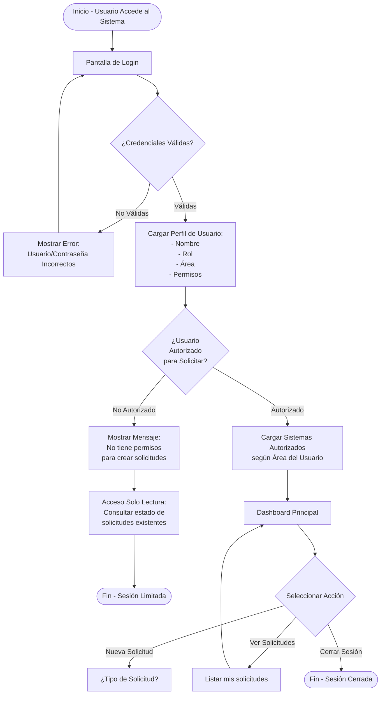
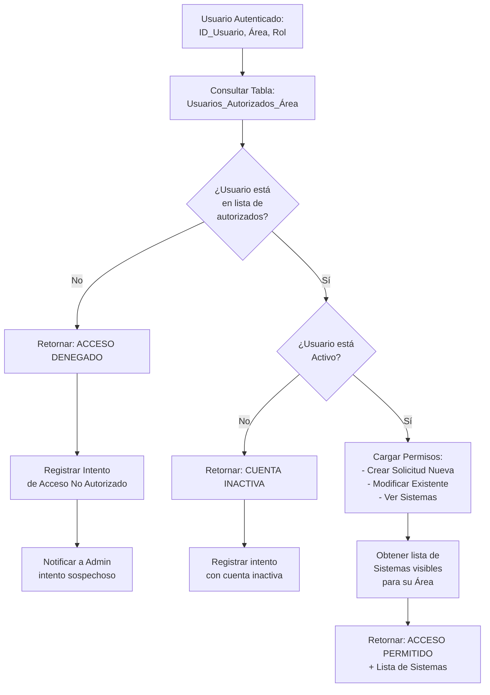
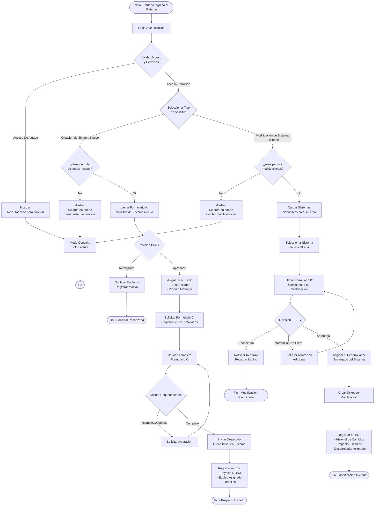
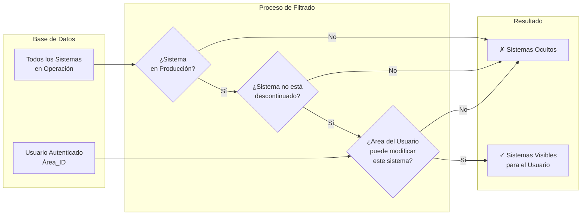
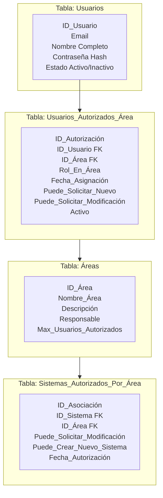
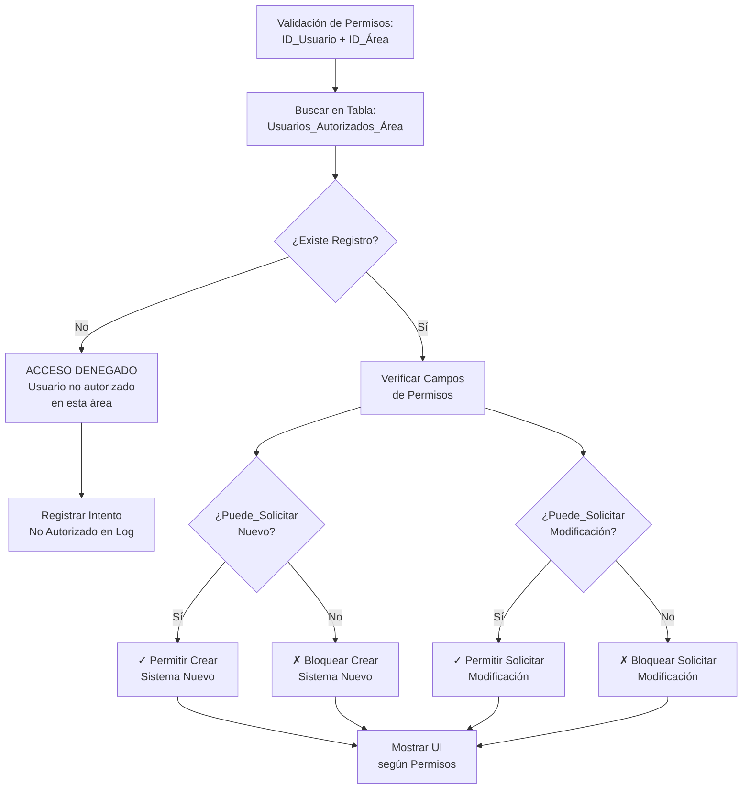
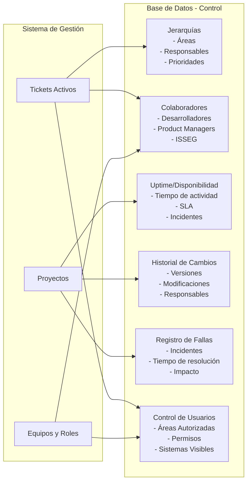
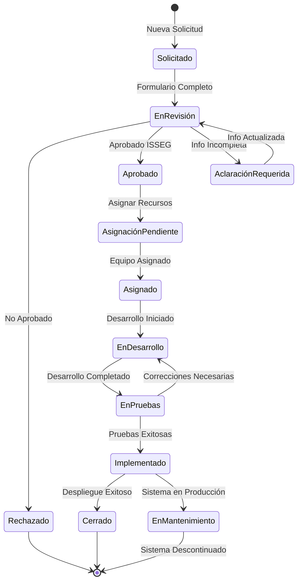

# Sistema de Gestión de Tickets de Desarrollo - Diagrama de Flujo

## 1. Diagrama de Autenticación y Control de Acceso



---

## 2. Diagrama de Validación de Permisos de Área



---

## 3. Diagrama de Proceso Principal con Control de Acceso



---

## 4. Diagrama de Filtrado de Sistemas por Área



---

## 5. Diagrama de Estructura de Control de Usuarios



---

## 6. Tabla de Permisos por Rol y Área



---

## Diagrama de Control y Registro en Base de Datos



---

## Diagrama de Estados del Ticket



## Leyenda y Descripción de Procesos

### Componentes del Sistema de Control de Acceso

#### 1. Autenticación y Autorización
- **Login**: Validación de credenciales de usuario
- **Control de Área**: Verificación de permisos según área asignada
- **Validación de Rol**: Confirmación de permisos específicos (crear nuevo/modificar)

#### 2. Estructura de Control de Usuarios
```
USUARIOS (Tabla Base)
    ↓
USUARIOS_AUTORIZADOS_ÁREA (Asignación por Área)
    ↓
PERMISOS (Crear Sistema Nuevo / Modificar Existente)
    ↓
SISTEMAS_AUTORIZADOS_POR_ÁREA (Sistemas Visibles)
```

#### 3. Filtrado de Sistemas
Cada usuario ve **solo** los sistemas para los cuales su área tiene autorización:
- Usuario de Área RRHH → Ve solo sistemas de RRHH
- Usuario de Área Finanzas → Ve solo sistemas de Finanzas
- Usuario de Área TI → Acceso a múltiples sistemas (si está autorizado)

#### 4. Niveles de Permisos
| Permiso | Descripción | Control |
|---------|-------------|---------|
| **Crear Sistema Nuevo** | Permite solicitar creación de nuevo sistema | Campo: `Puede_Solicitar_Nuevo` |
| **Solicitar Modificación** | Permite pedir cambios en sistemas existentes | Campo: `Puede_Solicitar_Modificación` |
| **Ver Sistema** | Acceso a información y estado del sistema | Tabla: `Sistemas_Autorizados_Por_Área` |
| **Consulta Solo Lectura** | Usuario bloqueado puede ver pero no actuar | Acceso limitado a dashboards |

---

### Tipos de Formularios
- **Formulario A**: Solicitud de Sistema Nuevo (justificación, alcance, beneficios)
- **Formulario B**: Cuestionario de Modificación (cambios requeridos, impacto, urgencia)
- **Formulario C**: Requerimientos Detallados (especificaciones técnicas completas)

### Roles del Sistema
- **ISSEG**: Revisa, aprueba/rechaza solicitudes, asigna prioridades
- **Desarrollador**: Ejecuta desarrollo y mantenimiento
- **Product Manager**: Coordina requerimientos y seguimiento de proyecto
- **Usuario de Área**: Solicita nuevos sistemas o modificaciones (con permisos)

### Puntos de Control Críticos
1. **Autenticación**: Login con validación de credenciales
2. **Autorización de Área**: Verificación de usuario en tabla `Usuarios_Autorizados_Área`
3. **Validación de Permisos**: Confirmar `Puede_Solicitar_Nuevo` o `Puede_Solicitar_Modificación`
4. **Filtrado de Sistemas**: Mostrar solo sistemas autorizados para el área
5. **Revisión ISSEG**: Aprobación/rechazo de solicitudes
6. **Asignación de Recursos**: Designación de equipo de desarrollo
7. **Registro en BD**: Trazabilidad completa de cambios

---

## Queries SQL para Control de Acceso

### Validar si usuario puede solicitar

```sql
SELECT 
    u.ID_Usuario,
    u.Nombre,
    ua.ID_Área,
    a.Nombre_Área,
    ua.Puede_Solicitar_Nuevo,
    ua.Puede_Solicitar_Modificación,
    ua.Activo
FROM Usuarios u
JOIN Usuarios_Autorizados_Área ua ON u.ID_Usuario = ua.ID_Usuario
JOIN Áreas a ON ua.ID_Área = a.ID_Área
WHERE u.ID_Usuario = @ID_Usuario AND ua.Activo = 1;
```

### Obtener sistemas visibles para un usuario

```sql
SELECT DISTINCT
    s.ID_Sistema,
    s.Nombre_Sistema,
    s.Tipo_Sistema,
    s.Estado_Actual,
    saa.Puede_Solicitar_Modificación
FROM Sistemas s
JOIN Sistemas_Autorizados_Por_Área saa ON s.ID_Sistema = saa.ID_Sistema
JOIN Usuarios_Autorizados_Área ua ON saa.ID_Área = ua.ID_Área
WHERE ua.ID_Usuario = @ID_Usuario
  AND ua.Activo = 1
  AND saa.Activo = 1
  AND s.Estado_Actual IN ('Producción', 'Mantenimiento')
ORDER BY s.Nombre_Sistema;
```

### Registrar intento de acceso no autorizado

```sql
INSERT INTO Audit_Acceso_No_Autorizado (
    ID_Usuario,
    Timestamp,
    Tipo_Intento,
    IP_Origen,
    Motivo_Denegación,
    Acción_Tomada
)
VALUES (
    @ID_Usuario,
    NOW(),
    'SOLICITUD_FORMULARIO',
    @IP,
    'Usuario no autorizado en área solicitante',
    'ACCESO DENEGADO - REGISTRADO'
);
```
