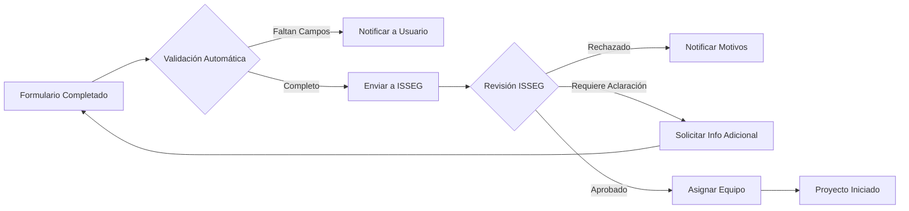

# Estructura de Formularios del Sistema de Gestión de Tickets

## Formulario A: Solicitud de Sistema Nuevo

### Sección 1: Información General
| Campo | Tipo | Obligatorio | Descripción |
|-------|------|-------------|-------------|
| **ID Solicitud** | Texto (Auto) | Sí | Generado automáticamente: SN-YYYY-NNNN |
| **Fecha de Solicitud** | Fecha | Sí | Fecha automática de creación |
| **Solicitante** | Texto | Sí | Nombre completo del solicitante |
| **Área/Departamento** | Lista desplegable | Sí | Área que solicita el sistema |
| **Cargo** | Texto | Sí | Puesto del solicitante |
| **Email de Contacto** | Email | Sí | Correo institucional |
| **Teléfono/Extensión** | Texto | Sí | Contacto directo |

### Sección 2: Descripción del Sistema
| Campo | Tipo | Obligatorio | Descripción |
|-------|------|-------------|-------------|
| **Nombre del Sistema Propuesto** | Texto (100 chars) | Sí | Nombre descriptivo y claro |
| **Tipo de Sistema** | Lista desplegable | Sí | Web, Escritorio, Móvil, API, Híbrido |
| **Descripción General** | Texto largo (500 chars) | Sí | ¿Qué hace el sistema? Descripción funcional |
| **Problema que Resuelve** | Texto largo (500 chars) | Sí | Situación actual que motiva la necesidad |

### Sección 3: Justificación y Alcance
| Campo | Tipo | Obligatorio | Descripción |
|-------|------|-------------|-------------|
| **Justificación del Negocio** | Texto largo (1000 chars) | Sí | Por qué es necesario este sistema |
| **Beneficios Esperados** | Checkbox múltiple + Texto | Sí | Ahorro de tiempo, reducción de errores, automatización, cumplimiento normativo, mejora de servicio, etc. |
| **Usuarios Finales Estimados** | Numérico | Sí | Cantidad aproximada de usuarios |
| **Áreas Involucradas** | Checkbox múltiple | Sí | Departamentos que utilizarán el sistema |
| **Prioridad del Negocio** | Radio button | Sí | Crítica / Alta / Media / Baja |
| **Criticidad** | Radio button | Sí | Esencial para operación / Mejora de proceso / Optimización |

### Sección 4: Alcance Preliminar
| Campo | Tipo | Obligatorio | Descripción |
|-------|------|-------------|-------------|
| **Funcionalidades Principales** | Texto largo (1000 chars) | Sí | Lista de funciones clave requeridas |
| **Integraciones Necesarias** | Checkbox + Texto | No | Sistemas existentes con los que debe conectarse |
| **Plataforma Preferida** | Lista desplegable | Sí | Web, Windows, Linux, Android, iOS, Multiplataforma |
| **Acceso Esperado** | Radio button | Sí | Interno (red local) / Externo (internet) / Ambos |

### Sección 5: Recursos y Timeline
| Campo | Tipo | Obligatorio | Descripción |
|-------|------|-------------|-------------|
| **Fecha Límite Deseada** | Fecha | No | Cuándo se necesita en operación |
| **Presupuesto Estimado** | Numérico + Moneda | No | Recursos financieros disponibles |
| **Recursos Humanos Disponibles** | Texto | No | Personal de área que puede apoyar |

### Sección 6: Documentación Adicional
| Campo | Tipo | Obligatorio | Descripción |
|-------|------|-------------|-------------|
| **Archivos Adjuntos** | Upload | No | Diagramas, mockups, documentos de referencia |
| **Comentarios Adicionales** | Texto largo | No | Información complementaria relevante |

### Sección 7: Aprobaciones
| Campo | Tipo | Obligatorio | Descripción |
|-------|------|-------------|-------------|
| **Aprobación Jefe de Área** | Firma digital | Sí | Confirmación del superior inmediato |
| **Visto Bueno Director** | Firma digital | Sí | Para proyectos de alta prioridad |

---

## Formulario B: Cuestionario de Modificación de Sistema Existente

### Sección 1: Identificación
| Campo | Tipo | Obligatorio | Descripción |
|-------|------|-------------|-------------|
| **ID Modificación** | Texto (Auto) | Sí | Generado: MOD-YYYY-NNNN |
| **Fecha de Solicitud** | Fecha | Sí | Automática |
| **Sistema a Modificar** | Lista desplegable | Sí | Selección de inventario de sistemas |
| **Versión Actual** | Texto (Auto) | Sí | Se llena automáticamente según sistema |
| **Solicitante** | Texto | Sí | Nombre completo |
| **Área/Departamento** | Texto (Auto) | Sí | Desde perfil de usuario |
| **Email de Contacto** | Email | Sí | Correo institucional |

### Sección 2: Descripción del Cambio
| Campo | Tipo | Obligatorio | Descripción |
|-------|------|-------------|-------------|
| **Tipo de Modificación** | Radio button | Sí | Nueva funcionalidad / Corrección de error / Mejora de rendimiento / Cambio de interfaz / Integración / Otro |
| **Descripción Detallada** | Texto largo (1000 chars) | Sí | Explicación clara del cambio solicitado |
| **Módulo(s) Afectado(s)** | Checkbox | Sí | Partes del sistema que se modificarán |

### Sección 3: Análisis de Necesidad
| Campo | Tipo | Obligatorio | Descripción |
|-------|------|-------------|-------------|
| **Razón del Cambio** | Texto largo (500 chars) | Sí | Por qué es necesaria esta modificación |
| **Situación Actual** | Texto largo (500 chars) | Sí | Cómo funciona ahora |
| **Situación Deseada** | Texto largo (500 chars) | Sí | Cómo debería funcionar |
| **Frecuencia de Uso** | Radio button | Sí | Diaria / Semanal / Mensual / Ocasional |

### Sección 4: Análisis de Impacto
| Campo | Tipo | Obligatorio | Descripción |
|-------|------|-------------|-------------|
| **Urgencia** | Radio button | Sí | Inmediata / Alta / Media / Baja |
| **Impacto en Operación** | Radio button | Sí | Crítico (bloquea operación) / Alto / Medio / Bajo |
| **Usuarios Afectados** | Numérico | Sí | Cantidad de usuarios impactados |
| **Impacto en Otros Sistemas** | Checkbox + Texto | Sí | ¿Afecta a otros sistemas integrados? |
| **Requiere Migración de Datos** | Radio button | Sí | Sí / No |
| **Requiere Capacitación** | Radio button | Sí | Sí / No |

### Sección 5: Detalles Técnicos
| Campo | Tipo | Obligatorio | Descripción |
|-------|------|-------------|-------------|
| **Funcionalidad Específica** | Texto largo (1000 chars) | Sí | Descripción técnica del requerimiento |
| **Campos/Datos Involucrados** | Texto largo | No | Especificar datos que se modifican |
| **Validaciones Requeridas** | Texto largo | No | Reglas de negocio a implementar |
| **Reportes/Salidas Nuevas** | Texto largo | No | Documentos o consultas a generar |

### Sección 6: Contexto y Referencias
| Campo | Tipo | Obligatorio | Descripción |
|-------|------|-------------|-------------|
| **Ticket de Error Relacionado** | Texto | No | Si es corrección, número de ticket |
| **Evidencia del Problema** | Upload | No | Screenshots, logs, videos |
| **Fecha Límite** | Fecha | No | Cuándo se requiere el cambio |
| **Horario Preferido de Implementación** | Texto | No | Para minimizar impacto operativo |

### Sección 7: Alternativas y Workarounds
| Campo | Tipo | Obligatorio | Descripción |
|-------|------|-------------|-------------|
| **¿Existe solución temporal?** | Radio button | Sí | Sí / No |
| **Descripción de Workaround** | Texto largo | Condicional | Si existe, describir la solución temporal |
| **Comentarios Adicionales** | Texto largo | No | Información complementaria |

### Sección 8: Revisión ISSEG
| Campo | Tipo | Obligatorio | Descripción |
|-------|------|-------------|-------------|
| **Estado de Revisión** | Lista (Sistema) | Sí | Pendiente / En Revisión / Aprobada / Rechazada / Requiere Aclaración |
| **Observaciones ISSEG** | Texto largo | Condicional | Comentarios del revisor |
| **Desarrollador Asignado** | Lista desplegable | Condicional | Asignación si se aprueba |
| **Estimación de Esfuerzo** | Numérico (horas) | Condicional | Horas estimadas de desarrollo |

---

## Formulario C: Levantamiento de Requerimientos Detallado

### Sección 1: Información del Proyecto
| Campo | Tipo | Obligatorio | Descripción |
|-------|------|-------------|-------------|
| **ID Proyecto** | Texto (Auto) | Sí | Referencia al ticket aprobado |
| **Nombre del Sistema** | Texto (Auto) | Sí | Desde Formulario A |
| **Product Manager Asignado** | Texto (Auto) | Sí | Desde asignación ISSEG |
| **Desarrollador Líder** | Texto (Auto) | Sí | Desde asignación ISSEG |
| **Fecha de Inicio** | Fecha | Sí | Fecha de levantamiento |
| **Responsable de Requerimientos** | Texto | Sí | Usuario de área que define necesidades |

### Sección 2: Objetivos y Alcance Técnico
| Campo | Tipo | Obligatorio | Descripción |
|-------|------|-------------|-------------|
| **Objetivo General del Sistema** | Texto largo (500 chars) | Sí | Meta principal del sistema |
| **Objetivos Específicos** | Texto largo (1000 chars) | Sí | Lista numerada de objetivos concretos |
| **Alcance Funcional** | Texto largo (1000 chars) | Sí | Qué sí incluye el sistema |
| **Fuera de Alcance** | Texto largo (1000 chars) | Sí | Qué NO incluye el sistema (clarificar límites) |

### Sección 3: Actores y Roles del Sistema
| Campo | Tipo | Obligatorio | Descripción |
|-------|------|-------------|-------------|
| **Listado de Roles** | Tabla dinámica | Sí | Rol / Descripción / Permisos / Cantidad de usuarios |
| **Diagrama de Actores** | Upload | No | Diagrama de casos de uso (opcional) |

**Estructura de Tabla de Roles:**
| Rol | Descripción | Permisos Generales | Cant. Usuarios |
|-----|-------------|-------------------|----------------|
| Administrador | Gestión completa | CRUD completo, configuración | 2-3 |
| Usuario Operativo | Registro diario | Crear, consultar, editar propios | 50+ |
| Supervisor | Revisión y aprobación | Consultar todos, aprobar | 5-10 |
| Consulta | Solo visualización | Lectura de reportes | Variable |

### Sección 4: Módulos Funcionales
**Tabla de Módulos:** (Repetible para cada módulo)

| Campo | Tipo | Obligatorio | Descripción |
|-------|------|-------------|-------------|
| **Nombre del Módulo** | Texto | Sí | Ej: Gestión de Usuarios, Registro de Incidentes |
| **Descripción** | Texto largo | Sí | Funcionalidad general del módulo |
| **Prioridad** | Radio button | Sí | Crítico (MVP) / Importante / Deseable |
| **Casos de Uso** | Tabla anidada | Sí | Ver estructura abajo |
| **Dependencias** | Texto | No | Otros módulos o sistemas de los que depende |

**Tabla de Casos de Uso (por módulo):**
| Caso de Uso | Actor | Descripción | Flujo Normal | Flujo Alternativo |
|-------------|-------|-------------|--------------|-------------------|
| CU-01: Registrar Usuario | Admin | Dar de alta usuario nuevo | 1. Ingresa datos 2. Valida 3. Guarda | Si datos inválidos, muestra error |

### Sección 5: Requerimientos Funcionales
**Tabla de RF:** (Usar formato estándar IEEE)

| ID | Descripción del Requerimiento | Prioridad | Módulo | Criterio de Aceptación |
|----|------------------------------|-----------|--------|----------------------|
| RF-001 | El sistema debe permitir registro de usuarios con email único | Crítica | Usuarios | Usuario creado y email de confirmación enviado |
| RF-002 | El sistema debe generar reporte PDF de actividades | Alta | Reportes | PDF generado con datos correctos en < 5 seg |

| Campo | Tipo | Obligatorio | Descripción |
|-------|------|-------------|-------------|
| **Requerimientos Funcionales** | Tabla dinámica | Sí | Mínimo 10 RF principales |
| **Reglas de Negocio** | Texto largo | Sí | Validaciones, cálculos, restricciones |

### Sección 6: Requerimientos No Funcionales
| Campo | Tipo | Obligatorio | Descripción |
|-------|------|-------------|-------------|
| **Rendimiento** | Texto largo | Sí | Tiempo de respuesta esperado, usuarios concurrentes |
| **Disponibilidad** | Texto | Sí | Ej: 99.5% uptime, 24/7 |
| **Seguridad** | Checkbox + Texto | Sí | Autenticación, cifrado, roles, auditoría |
| **Usabilidad** | Texto largo | Sí | Estándares de interfaz, accesibilidad |
| **Compatibilidad** | Texto | Sí | Navegadores, dispositivos, SO soportados |
| **Escalabilidad** | Texto | No | Capacidad de crecimiento futura |
| **Mantenibilidad** | Texto | No | Facilidad de actualización |

### Sección 7: Modelo de Datos
| Campo | Tipo | Obligatorio | Descripción |
|-------|------|-------------|-------------|
| **Entidades Principales** | Tabla dinámica | Sí | Nombre / Descripción / Atributos clave |
| **Diagrama Entidad-Relación** | Upload | Recomendado | Modelo conceptual de BD |
| **Volumen de Datos Estimado** | Texto | Sí | Registros esperados por entidad |

**Tabla de Entidades:**
| Entidad | Descripción | Atributos Principales | Relaciones |
|---------|-------------|----------------------|------------|
| Usuario | Personas que usan el sistema | id, nombre, email, rol_id, activo | 1:N con Sesiones |
| Ticket | Solicitudes de servicio | id, titulo, descripción, estado_id, usuario_id | N:1 con Usuario |

### Sección 8: Integraciones y APIs
| Campo | Tipo | Obligatorio | Descripción |
|-------|------|-------------|-------------|
| **Sistemas a Integrar** | Tabla dinámica | Condicional | Sistema / Tipo de integración / Datos intercambiados |
| **APIs Externas** | Tabla dinámica | No | Servicio / Propósito / Autenticación |
| **Servicios Web Propios** | Texto largo | No | Endpoints que expondrá el sistema |

### Sección 9: Interfaces de Usuario
| Campo | Tipo | Obligatorio | Descripción |
|-------|------|-------------|-------------|
| **Pantallas Principales** | Tabla dinámica | Sí | Nombre / Descripción / Elementos clave |
| **Mockups/Wireframes** | Upload múltiple | Recomendado | Diseños preliminares de UI |
| **Flujos de Navegación** | Upload | Recomendado | Diagrama de navegación entre pantallas |

### Sección 10: Reportes y Salidas
| Campo | Tipo | Obligatorio | Descripción |
|-------|------|-------------|-------------|
| **Reportes Requeridos** | Tabla dinámica | Sí | Ver estructura abajo |
| **Formatos de Exportación** | Checkbox | Sí | PDF / Excel / CSV / Word |

**Tabla de Reportes:**
| ID Reporte | Nombre | Descripción | Datos Incluidos | Frecuencia | Destinatarios |
|------------|--------|-------------|-----------------|-----------|---------------|
| REP-01 | Resumen Mensual de Tickets | Estadísticas de tickets por estado | Total, abiertos, cerrados, tiempo promedio | Mensual | Gerencia |

### Sección 11: Infraestructura y Despliegue
| Campo | Tipo | Obligatorio | Descripción |
|-------|------|-------------|-------------|
| **Ambiente de Alojamiento** | Radio button | Sí | On-premise / Cloud / Híbrido |
| **Servidor de Aplicaciones** | Texto | Sí | Tecnología preferida (IIS, Apache, Nginx) |
| **Base de Datos** | Lista desplegable | Sí | SQL Server, MySQL, PostgreSQL, Oracle, MongoDB |
| **Backup y Recuperación** | Texto largo | Sí | Políticas de respaldo requeridas |
| **Ambientes Requeridos** | Checkbox | Sí | Desarrollo / QA / Staging / Producción |

### Sección 12: Capacitación y Documentación
| Campo | Tipo | Obligatorio | Descripción |
|-------|------|-------------|-------------|
| **Requiere Manual de Usuario** | Radio button | Sí | Sí / No |
| **Requiere Capacitación** | Radio button | Sí | Sí / No |
| **Tipo de Capacitación** | Checkbox | Condicional | Presencial / Virtual / Videos / Documentos |
| **Cantidad de Usuarios a Capacitar** | Numérico | Condicional | Estimación |

### Sección 13: Criterios de Aceptación Globales
| Campo | Tipo | Obligatorio | Descripción |
|-------|------|-------------|-------------|
| **Criterios de Aceptación del Proyecto** | Texto largo (1000 chars) | Sí | Condiciones para considerar el proyecto exitoso |
| **Plan de Pruebas** | Upload | No | Documento detallado de testing |
| **Métricas de Éxito** | Texto largo | Sí | KPIs a medir post-implementación |

### Sección 14: Riesgos y Restricciones
| Campo | Tipo | Obligatorio | Descripción |
|-------|------|-------------|-------------|
| **Riesgos Identificados** | Tabla dinámica | Sí | Riesgo / Probabilidad / Impacto / Mitigación |
| **Restricciones Técnicas** | Texto largo | No | Limitaciones tecnológicas o de infraestructura |
| **Restricciones de Negocio** | Texto largo | No | Presupuesto, tiempo, recursos humanos |

### Sección 15: Anexos y Documentación de Soporte
| Campo | Tipo | Obligatorio | Descripción |
|-------|------|-------------|-------------|
| **Documentos de Referencia** | Upload múltiple | No | Normativas, procesos actuales, etc. |
| **Glosario de Términos** | Texto largo | Recomendado | Definiciones de términos técnicos del negocio |
| **Firmas de Aprobación** | Firma digital | Sí | Product Manager, Desarrollador Líder, Solicitante |

---

## Validaciones y Reglas de los Formularios

### Formulario A - Validaciones
- Email debe ser dominio institucional
- Prioridad crítica requiere aprobación de director
- Campos obligatorios bloqueados hasta completar

### Formulario B - Validaciones
- Solo puede modificar sistemas en estado "Producción" o "Mantenimiento"
- Urgencia "Inmediata" genera alerta automática a ISSEG
- Si impacto es "Crítico", requiere plan de rollback

### Formulario C - Validaciones
- Mínimo 10 requerimientos funcionales documentados
- Al menos 3 requerimientos no funcionales especificados
- Mockups obligatorios para módulos de prioridad "Crítica"
- Firma de Product Manager y Desarrollador Líder requerida para iniciar desarrollo

---

## Workflow de Aprobaciones

