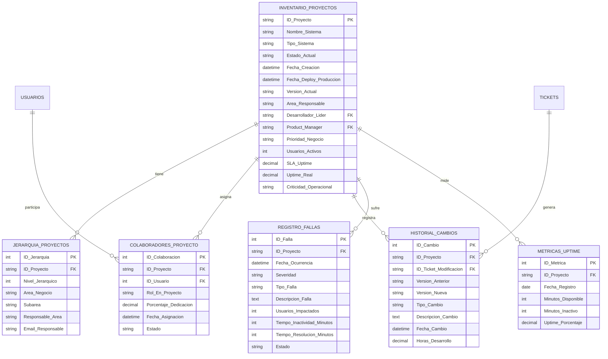

# Dashboard de Inventario de Proyectos - Sistema de Gestión de Tickets

## 1. Estructura de Tabla Principal: Inventario de Proyectos

### Vista General de Proyectos

| Campo | Tipo de Dato | Descripción | Uso en Dashboard |
|-------|--------------|-------------|------------------|
| **ID_Proyecto** | VARCHAR(20) PK | Identificador único (SIS-YYYY-NNNN) | Filtro y búsqueda |
| **Nombre_Sistema** | VARCHAR(200) | Nombre descriptivo del sistema | Título principal |
| **Tipo_Sistema** | ENUM | Web, Escritorio, Móvil, API, Híbrido | Categorización visual |
| **Estado_Actual** | ENUM | Desarrollo, QA, Producción, Mantenimiento, Descontinuado | Indicador de estado |
| **Fecha_Creacion** | DATETIME | Cuándo se creó el proyecto | Orden cronológico |
| **Fecha_Deploy_Produccion** | DATETIME | Primera implementación en producción | Antigüedad del sistema |
| **Version_Actual** | VARCHAR(20) | Versión semántica (1.2.3) | Control de versiones |
| **Area_Responsable** | VARCHAR(100) | Departamento propietario | Agrupación por área |
| **Desarrollador_Lider** | VARCHAR(100) FK | Responsable técnico principal | Contacto técnico |
| **Product_Manager** | VARCHAR(100) FK | Responsable de producto | Contacto de negocio |
| **Prioridad_Negocio** | ENUM | Crítica, Alta, Media, Baja | Priorización visual |
| **Usuarios_Activos** | INT | Cantidad de usuarios activos mensuales | Medición de uso |
| **SLA_Uptime** | DECIMAL(5,2) | % de disponibilidad acordado (99.5%) | Objetivo de disponibilidad |
| **Uptime_Real** | DECIMAL(5,2) | % de disponibilidad real último mes | Métrica de rendimiento |
| **Criticidad_Operacional** | ENUM | Esencial, Importante, Accesoria | Impacto en operaciones |

---

## 2. Tablas Relacionadas para Control Detallado

### 2.1 Tabla: Jerarquía de Proyectos

**Campos para Dashboard:**
- Organigrama visual de dependencias
- Filtro por jerarquía
- Contactos rápidos

### 2.2 Tabla: Colaboradores del Proyecto

**Campos para Dashboard:**
- Listado de equipo actual
- Carga de trabajo por desarrollador
- Histórico de participación

### 2.3 Tabla: Historial de Cambios y Versiones

**Campos para Dashboard:**
- Timeline de evolución
- Frecuencia de cambios
- Tipo de modificaciones predominantes

### 2.4 Tabla: Registro de Fallas e Incidentes

**Campos para Dashboard:**
- MTBF (Mean Time Between Failures)
- MTTR (Mean Time To Resolution)
- Fallas abiertas vs cerradas
- Tendencia de severidad

### 2.5 Tabla: Métricas de Uptime y Disponibilidad

**Cálculo de Uptime Mensual:**

---

## 3. Diseño de Dashboard: Vistas Principales

### Vista 1: Dashboard Ejecutivo (KPIs Principales)

#### Indicadores Clave (Cards Superiores)
```
┌─────────────────────┐  ┌─────────────────────┐  ┌─────────────────────┐  ┌─────────────────────┐
│  Total Proyectos    │  │  En Producción      │  │  En Desarrollo      │  │  Incidentes Abiertos│
│       48            │  │       32            │  │       12            │  │        7            │
│   +3 este mes       │  │   Uptime: 99.2%     │  │   4 retrasados      │  │   2 críticos        │
└─────────────────────┘  └─────────────────────┘  └─────────────────────┘  └─────────────────────┘
```

#### Gráfica: Distribución de Proyectos por Estado
```
[Gráfico de Dona/Pie Chart]
- Producción: 32 (66%)
- Desarrollo: 12 (25%)
- Mantenimiento: 3 (6%)
- Descontinuado: 1 (2%)
```

#### Gráfica: Uptime Promedio por Proyecto Crítico
```
[Gráfico de Barras Horizontales]
Sistema A: ████████████████████ 99.8%
Sistema B: ███████████████████  98.9%
Sistema C: ██████████████████   97.5%
Sistema D: ███████████████████  99.1%
```

#### Tabla: Top 5 Proyectos con Más Fallas (Último Mes)
| Proyecto | Fallas Totales | Críticas | MTTR Promedio | Uptime |
|----------|----------------|----------|---------------|--------|
| Sistema Portal Web | 12 | 2 | 45 min | 99.1% |
| Sistema ERP | 8 | 1 | 120 min | 98.5% |
| API Pagos | 7 | 3 | 30 min | 97.8% |

---

### Vista 2: Inventario Completo de Proyectos (Tabla Dinámica)

**Filtros Disponibles:**
- Estado (Multiselect)
- Área Responsable (Dropdown)
- Desarrollador Líder (Dropdown)
- Prioridad (Multiselect)
- Rango de Fechas de Creación

**Columnas de la Tabla:**
| ID | Nombre | Tipo | Estado | Área | Uptime | Última Falla | Modificaciones (30d) | Acciones |
|----|--------|------|--------|------|--------|--------------|---------------------|----------|
| SIS-2024-001 | Portal Empleados | Web | Producción | RRHH | 99.5% | Hace 5 días | 2 | [Ver] [Editar] |
| SIS-2024-002 | ERP Financiero | Web | Producción | Finanzas | 98.8% | Hace 2 días | 5 | [Ver] [Editar] |
| SIS-2025-015 | App Móvil Tickets | Móvil | Desarrollo | IT | N/A | N/A | 15 | [Ver] [Editar] |

**Indicadores Visuales:**
- 🔴 Uptime < SLA
- 🟡 Uptime cerca del límite (±0.5%)
- 🟢 Uptime cumpliendo SLA
- ⚠️ Falla crítica abierta
- 🔧 Mantenimiento programado

**Acciones Rápidas:**
- Ver detalle completo
- Histórico de cambios
- Registro de fallas
- Asignar modificación
- Generar reporte

---

### Vista 3: Análisis de Fallas y Modificaciones

#### Sección A: Métricas de Fallas

**KPIs de Confiabilidad:**
```
┌─────────────────────┐  ┌─────────────────────┐  ┌─────────────────────┐
│  MTBF (Promedio)    │  │  MTTR (Promedio)    │  │  Tasa de Fallos     │
│    720 horas        │  │    65 minutos       │  │   0.3 fallas/día    │
│  (30 días)          │  │  (-15 min vs mes ant)│ │  (-20% vs mes ant)  │
└─────────────────────┘  └─────────────────────┘  └─────────────────────┘
```

**Gráfica: Tendencia de Fallas por Mes (Últimos 12 meses)**
```
[Gráfico de Líneas]
Eje Y: Cantidad de Fallas
Eje X: Meses
Líneas:
- Total de Fallas
- Fallas Críticas
- Fallas Resueltas en <1 hora
```

**Gráfica: Distribución por Tipo de Falla**
```
[Gráfico de Barras]
Caída del Sistema:     ████████ 15
Error Funcional:       ██████████████ 28
Lentitud:              ████████████ 22
Error Integración:     ██████ 10
Pérdida de Datos:      ██ 3
Seguridad:             ████ 6
```

#### Sección B: Análisis de Modificaciones

**Tabla: Resumen de Modificaciones por Proyecto (Último Trimestre)**
| Proyecto | Total Cambios | Nuevas Funciones | Bug Fixes | Mejoras | Horas Totales |
|----------|---------------|------------------|-----------|---------|---------------|
| Portal Empleados | 18 | 5 | 10 | 3 | 240 |
| ERP Financiero | 25 | 8 | 12 | 5 | 420 |
| Sistema Inventario | 12 | 2 | 8 | 2 | 150 |

**Gráfica: Velocidad de Cambios (Cambios/Mes por Proyecto)**
```
[Gráfico de Área Apilada]
- Permite ver qué proyectos están más activos
- Identificar proyectos estancados
```

---

### Vista 4: Gestión de Equipos y Carga de Trabajo

**Tabla: Desarrolladores y Carga Actual**
| Desarrollador | Proyectos Asignados | Tickets Activos | Horas Comprometidas | Disponibilidad |
|---------------|---------------------|-----------------|---------------------|----------------|
| Juan Pérez | 3 (Líder en 1) | 8 | 120h / 160h | 25% |
| María López | 2 (Líder en 2) | 12 | 155h / 160h | 3% |
| Carlos Ruiz | 4 | 6 | 80h / 160h | 50% |

**Gráfica: Distribución de Carga por Desarrollador**
```
[Gráfico de Barras Apiladas Horizontales]
Juan Pérez:    ████████████████████ 75%
María López:   ███████████████████████ 97%
Carlos Ruiz:   ████████████ 50%
Ana Torres:    ████████████████ 65%
```

---

## 4. Consultas SQL Útiles para el Dashboard

### Query 1: Proyectos con Uptime Bajo el SLA

### Query 2: Top 10 Proyectos con Más Fallas (Últimos 30 días)

### Query 3: Histórico de Cambios por Tipo (Últimos 3 meses)

### Query 4: MTBF y MTTR por Proyecto

### Query 5: Carga de Trabajo por Desarrollador

---

## 5. Alertas Automáticas y Notificaciones

### Sistema de Alertas Recomendado

| Condición | Destinatario | Prioridad | Acción |
|-----------|--------------|-----------|--------|
| Uptime < SLA por 2 días consecutivos | Desarrollador Líder + ISSEG | Alta | Email + Dashboard |
| Falla Crítica abierta > 4 horas | Desarrollador + PM + ISSEG | Crítica | Email + SMS |
| Proyecto sin cambios en 90 días | Product Manager | Baja | Email semanal |
| MTTR > 120 minutos (promedio mensual) | Desarrollador Líder + ISSEG | Media | Email + Reporte |
| 5+ fallas en 7 días (mismo proyecto) | Equipo completo + ISSEG | Alta | Email + Reunión |
| Carga de desarrollador > 95% | ISSEG | Media | Dashboard |

---

## 6. Exportación y Reportes

### Reportes Periódicos Automatizados

1. **Reporte Mensual Ejecutivo**
   - Resumen de KPIs
   - Top 10 proyectos por uptime
   - Top 10 proyectos por fallas
   - Distribución de modificaciones
   - Formato: PDF + Excel

2. **Reporte Trimestral de Confiabilidad**
   - Análisis de tendencias MTBF/MTTR
   - Proyectos que mejoraron/empeoraron
   - Causas raíz más comunes
   - Recomendaciones
   - Formato: PDF

3. **Reporte Semanal de Operaciones**
   - Incidentes de la semana
   - Cambios desplegados
   - Proyectos en riesgo
   - Formato: Email HTML

---

## 7. Integración con Herramientas de Monitoreo

### Recomendaciones de Integración

**Para Uptime Monitoring:**
- Integrar con Pingdom, UptimeRobot o New Relic
- API para sincronizar métricas de uptime automáticamente
- Webhooks para alertas en tiempo real

**Para Gestión de Código:**
- Integrar con Git (commits, branches, merges)
- Vincular commits con IDs de tickets
- Métricas de code churn y frecuencia de deploy

**Para Logs y Errores:**
- Integrar con Sentry, LogRocket o similar
- Crear registros de fallas automáticamente desde excepciones
- Clasificación automática de severidad

---

## 8. Modelo de Datos Completo (Diagrama ERD)



---

## 9. Implementación Técnica Recomendada

### Stack Tecnológico Sugerido

**Frontend Dashboard:**
- React + TypeScript + TailwindCSS
- Bibliotecas de gráficas: Chart.js o Recharts
- Tablas interactivas: AG-Grid o TanStack Table

**Backend API:**
- Node.js + Express o .NET Core
- GraphQL para consultas flexibles
- Cache con Redis para métricas en tiempo real

**Base de Datos:**
- PostgreSQL o SQL Server (datos transaccionales)
- InfluxDB o TimescaleDB (métricas de tiempo)
- Redis (cache y sesiones)

**Monitoreo y Alertas:**
- Prometheus + Grafana (métricas técnicas)
- ElasticSearch + Kibana (logs)
- Sistema de alertas: PagerDuty o custom con Twilio/SendGrid

---

Este dashboard proporciona visibilidad completa del ciclo de vida de los proyectos, permitiendo tomar decisiones basadas en datos y mejorar continuamente la confiabilidad de los sistemas.
