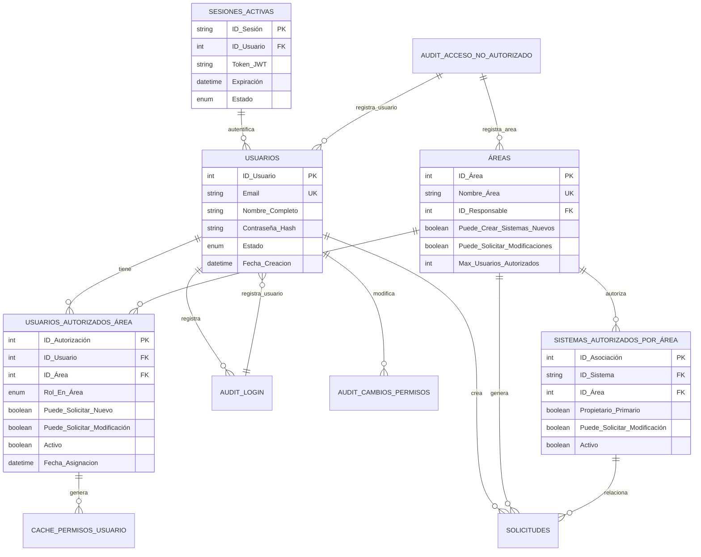

# Sistema de Control de Acceso y Usuarios - Estructura de Base de Datos

## 1. Tablas Principales para Control de Acceso

### 1.1 Tabla: Usuarios

```sql
CREATE TABLE Usuarios (
    ID_Usuario INT PRIMARY KEY AUTO_INCREMENT,
    Email VARCHAR(100) UNIQUE NOT NULL,
    Nombre_Completo VARCHAR(150) NOT NULL,
    Contraseña_Hash VARCHAR(255) NOT NULL,
    Teléfono VARCHAR(20),
    Puesto_Cargo VARCHAR(100),
    Fecha_Creacion DATETIME DEFAULT CURRENT_TIMESTAMP,
    Fecha_Ultimo_Login DATETIME NULL,
    Estado ENUM('Activo', 'Inactivo', 'Suspendido') DEFAULT 'Activo',
    Requiere_Cambio_Contraseña BOOLEAN DEFAULT FALSE,
    Intentos_Login_Fallidos INT DEFAULT 0,
    Bloqueado_Hasta DATETIME NULL,
    Ultima_Validacion_2FA DATETIME NULL,
    Habilitado_2FA BOOLEAN DEFAULT FALSE
);
```

**Descripción:**
- Tabla base de todos los usuarios del sistema
- Email único para evitar duplicados
- Contraseña almacenada en hash (bcrypt, scrypt o Argon2)
- Control de intentos fallidos para prevenir fuerza bruta
- Soporte para autenticación de dos factores

---

### 1.2 Tabla: Áreas (Departamentos)

```sql
CREATE TABLE Áreas (
    ID_Área INT PRIMARY KEY AUTO_INCREMENT,
    Nombre_Área VARCHAR(100) UNIQUE NOT NULL,
    Descripción TEXT,
    ID_Responsable INT,
    Email_Área VARCHAR(100),
    Teléfono_Área VARCHAR(20),
    Max_Usuarios_Autorizados INT DEFAULT 5,
    Puede_Crear_Sistemas_Nuevos BOOLEAN DEFAULT TRUE,
    Puede_Solicitar_Modificaciones BOOLEAN DEFAULT TRUE,
    Presupuesto_Anual DECIMAL(12,2),
    Fecha_Creacion DATETIME DEFAULT CURRENT_TIMESTAMP,
    Estado ENUM('Activo', 'Inactivo') DEFAULT 'Activo',
    FOREIGN KEY (ID_Responsable) REFERENCES Usuarios(ID_Usuario)
);
```

**Descripción:**
- Define las áreas/departamentos de la institución
- Control de cuántos usuarios autorizados por área
- Permisos a nivel de área (crear sistemas, solicitar modificaciones)
- Presupuesto asociado para control de costos

---

### 1.3 Tabla: Usuarios_Autorizados_Área (Asignación de Usuarios a Áreas)

```sql
CREATE TABLE Usuarios_Autorizados_Área (
    ID_Autorización INT PRIMARY KEY AUTO_INCREMENT,
    ID_Usuario INT NOT NULL,
    ID_Área INT NOT NULL,
    Rol_En_Área ENUM(
        'Responsable de Área',
        'Solicitante Autorizado',
        'Revisor',
        'Consulta'
    ) DEFAULT 'Solicitante Autorizado',
    Puede_Solicitar_Nuevo BOOLEAN DEFAULT FALSE,
    Puede_Solicitar_Modificación BOOLEAN DEFAULT TRUE,
    Puede_Aprobar_Solicitudes BOOLEAN DEFAULT FALSE,
    Puede_Gestionar_Usuarios_Área BOOLEAN DEFAULT FALSE,
    Fecha_Asignacion DATETIME DEFAULT CURRENT_TIMESTAMP,
    Fecha_Desasignacion DATETIME NULL,
    Activo BOOLEAN DEFAULT TRUE,
    Notas TEXT,
    FOREIGN KEY (ID_Usuario) REFERENCES Usuarios(ID_Usuario),
    FOREIGN KEY (ID_Área) REFERENCES Áreas(ID_Área),
    UNIQUE KEY unique_usuario_area (ID_Usuario, ID_Área),
    INDEX idx_usuario (ID_Usuario),
    INDEX idx_area (ID_Área)
);
```

**Descripción:**
- Define qué usuario pertenece a qué área
- Un usuario puede estar en múltiples áreas
- Control granular de permisos por área
- `Puede_Solicitar_Nuevo`: Solo un usuario por área (idealmente)
- `Puede_Solicitar_Modificación`: Múltiples usuarios pueden solicitar cambios
- `Puede_Aprobar_Solicitudes`: ISSEG puede aprobar (no usuarios de área)
- Registro de cuándo se asignó/desasignó

---

### 1.4 Tabla: Sistemas_Autorizados_Por_Área

```sql
CREATE TABLE Sistemas_Autorizados_Por_Área (
    ID_Asociación INT PRIMARY KEY AUTO_INCREMENT,
    ID_Sistema VARCHAR(20) NOT NULL,
    ID_Área INT NOT NULL,
    Propietario_Primario BOOLEAN DEFAULT FALSE,
    Puede_Solicitar_Modificación BOOLEAN DEFAULT TRUE,
    Puede_Crear_Versiones BOOLEAN DEFAULT FALSE,
    Requiere_Aprobación_Especial BOOLEAN DEFAULT FALSE,
    Costo_Mensual_Estimado DECIMAL(10,2),
    SLA_Acordado VARCHAR(50),
    Fecha_Autorización DATETIME DEFAULT CURRENT_TIMESTAMP,
    Fecha_Revocación DATETIME NULL,
    Activo BOOLEAN DEFAULT TRUE,
    Notas TEXT,
    FOREIGN KEY (ID_Sistema) REFERENCES Inventario_Proyectos(ID_Proyecto),
    FOREIGN KEY (ID_Área) REFERENCES Áreas(ID_Área),
    UNIQUE KEY unique_sistema_area (ID_Sistema, ID_Área),
    INDEX idx_sistema (ID_Sistema),
    INDEX idx_area (ID_Área)
);
```

**Descripción:**
- Define qué sistema está disponible para qué área
- `Propietario_Primario`: Área dueña del sistema
- `Puede_Solicitar_Modificación`: Si el área puede solicitar cambios
- Múltiples áreas pueden usar el mismo sistema
- Control de costos por área y sistema
- SLA acordado específico para la combinación

---

## 2. Tablas de Auditoría y Seguridad

### 2.1 Tabla: Audit_Login

```sql
CREATE TABLE Audit_Login (
    ID_Evento INT PRIMARY KEY AUTO_INCREMENT,
    ID_Usuario INT,
    Email_Utilizado VARCHAR(100),
    IP_Origen VARCHAR(50),
    User_Agent VARCHAR(500),
    Timestamp DATETIME DEFAULT CURRENT_TIMESTAMP,
    Exitoso BOOLEAN,
    Motivo_Fallo VARCHAR(255),
    Geolocalización VARCHAR(255),
    INDEX idx_usuario (ID_Usuario),
    INDEX idx_timestamp (Timestamp),
    FOREIGN KEY (ID_Usuario) REFERENCES Usuarios(ID_Usuario)
);
```

**Descripción:**
- Registro de todos los intentos de login
- Permite detectar accesos sospechosos
- Rastreo de IP y ubicación geográfica
- Base para alertas de seguridad

---

### 2.2 Tabla: Audit_Acceso_No_Autorizado

```sql
CREATE TABLE Audit_Acceso_No_Autorizado (
    ID_Evento INT PRIMARY KEY AUTO_INCREMENT,
    ID_Usuario INT,
    ID_Solicitud_Intento VARCHAR(20),
    Tipo_Intento ENUM(
        'CREAR_SISTEMA',
        'MODIFICAR_SISTEMA',
        'VER_SISTEMA',
        'ACCESO_ADMIN',
        'CAMBIO_PERMISOS'
    ),
    Sistema_Afectado VARCHAR(20),
    Área_Solicitante INT,
    IP_Origen VARCHAR(50),
    Timestamp DATETIME DEFAULT CURRENT_TIMESTAMP,
    Motivo_Denegación TEXT,
    Notificación_Enviada BOOLEAN DEFAULT FALSE,
    Acción_Tomada ENUM(
        'ACCESO_DENEGADO',
        'REQUIERE_APROBACION',
        'CUENTA_SUSPENDIDA'
    ),
    Notas_Admin TEXT,
    FOREIGN KEY (ID_Usuario) REFERENCES Usuarios(ID_Usuario),
    FOREIGN KEY (Área_Solicitante) REFERENCES Áreas(ID_Área),
    INDEX idx_usuario (ID_Usuario),
    INDEX idx_timestamp (Timestamp),
    INDEX idx_tipo (Tipo_Intento)
);
```

**Descripción:**
- Registro detallado de intentos de acceso no autorizado
- Auditoría completa para seguridad
- Base para investigaciones de incidentes
- Notificaciones automáticas a administradores

---

### 2.3 Tabla: Audit_Cambios_Permisos

```sql
CREATE TABLE Audit_Cambios_Permisos (
    ID_Evento INT PRIMARY KEY AUTO_INCREMENT,
    ID_Usuario_Afectado INT NOT NULL,
    ID_Usuario_Quien_Cambio INT,
    ID_Autorización_Modificada INT,
    Campo_Modificado VARCHAR(100),
    Valor_Anterior VARCHAR(255),
    Valor_Nuevo VARCHAR(255),
    Justificación TEXT,
    Timestamp DATETIME DEFAULT CURRENT_TIMESTAMP,
    IP_Quien_CAMBIO VARCHAR(50),
    FOREIGN KEY (ID_Usuario_Afectado) REFERENCES Usuarios(ID_Usuario),
    FOREIGN KEY (ID_Usuario_Quien_Cambio) REFERENCES Usuarios(ID_Usuario),
    FOREIGN KEY (ID_Autorización_Modificada) REFERENCES Usuarios_Autorizados_Área(ID_Autorización),
    INDEX idx_usuario_afectado (ID_Usuario_Afectado),
    INDEX idx_timestamp (Timestamp)
);
```

**Descripción:**
- Trazabilidad completa de cambios en permisos
- Quién cambió qué, cuándo y por qué
- Base para auditorías externas
- Cumplimiento normativo

---

## 3. Tabla de Solicitudes con Auditoría de Acceso

```sql
CREATE TABLE Solicitudes (
    ID_Solicitud VARCHAR(20) PRIMARY KEY,
    ID_Usuario_Solicitante INT NOT NULL,
    ID_Área_Solicitante INT NOT NULL,
    Tipo_Solicitud ENUM('Creación Sistema', 'Modificación Sistema') NOT NULL,
    ID_Sistema_Relacionado VARCHAR(20),
    Estado ENUM(
        'Borrador',
        'Pendiente Revisión',
        'En Revisión',
        'Aprobada',
        'Rechazada',
        'En Desarrollo',
        'Completada'
    ) DEFAULT 'Borrador',
    Fecha_Creacion DATETIME DEFAULT CURRENT_TIMESTAMP,
    Fecha_Envio DATETIME NULL,
    Fecha_Revisión DATETIME NULL,
    ID_Usuario_Revisor INT,
    Comentarios_Rechazo TEXT,
    Prioridad ENUM('Crítica', 'Alta', 'Media', 'Baja') DEFAULT 'Media',
    Archivo_Formulario LONGBLOB,
    Versión_Formulario INT DEFAULT 1,
    IP_Creación VARCHAR(50),
    User_Agent_Creación VARCHAR(500),
    FOREIGN KEY (ID_Usuario_Solicitante) REFERENCES Usuarios(ID_Usuario),
    FOREIGN KEY (ID_Área_Solicitante) REFERENCES Áreas(ID_Área),
    FOREIGN KEY (ID_Usuario_Revisor) REFERENCES Usuarios(ID_Usuario),
    INDEX idx_usuario (ID_Usuario_Solicitante),
    INDEX idx_area (ID_Área_Solicitante),
    INDEX idx_estado (Estado),
    INDEX idx_fecha (Fecha_Creacion)
);
```

---

## 4. Tablas para Validación en Tiempo Real

### 4.1 Tabla: Sesiones_Activas

```sql
CREATE TABLE Sesiones_Activas (
    ID_Sesión VARCHAR(255) PRIMARY KEY,
    ID_Usuario INT NOT NULL,
    Token_JWT VARCHAR(500),
    IP_Origen VARCHAR(50),
    User_Agent VARCHAR(500),
    Fecha_Inicio DATETIME DEFAULT CURRENT_TIMESTAMP,
    Última_Actividad DATETIME DEFAULT CURRENT_TIMESTAMP,
    Expiración DATETIME,
    Estado ENUM('Activa', 'Expirada', 'Revocada') DEFAULT 'Activa',
    Geolocalización VARCHAR(255),
    Dispositivo VARCHAR(255),
    FOREIGN KEY (ID_Usuario) REFERENCES Usuarios(ID_Usuario),
    INDEX idx_usuario (ID_Usuario),
    INDEX idx_expiracion (Expiración)
);
```

---

### 4.2 Tabla: Cache_Permisos_Usuario

```sql
CREATE TABLE Cache_Permisos_Usuario (
    ID_Cache INT PRIMARY KEY AUTO_INCREMENT,
    ID_Usuario INT NOT NULL,
    Permisos_JSON JSON, -- {"puede_solicitar_nuevo": true, "puede_solicitar_mod": true, ...}
    Sistemas_Autorizados JSON, -- Array de IDs de sistemas
    Áreas_Autorizadas JSON, -- Array de IDs de áreas
    Fecha_Actualización DATETIME DEFAULT CURRENT_TIMESTAMP,
    Válido_Hasta DATETIME,
    FOREIGN KEY (ID_Usuario) REFERENCES Usuarios(ID_Usuario),
    UNIQUE KEY unique_usuario (ID_Usuario),
    INDEX idx_valido (Válido_Hasta)
);
```

**Descripción:**
- Cache de permisos para mejorar rendimiento
- Se actualiza cuando cambian permisos o cada cierto tiempo
- Reduce carga de BD en validaciones frecuentes
- TTL configurable para invalidación

---

## 5. Procedimientos Almacenados Importantes

### 5.1 Obtener Permisos Completos del Usuario

```sql
DELIMITER $$

CREATE PROCEDURE ObtenerPermisosUsuario(
    IN p_ID_Usuario INT,
    OUT p_Puede_Solicitar_Nuevo BOOLEAN,
    OUT p_Puede_Solicitar_Modificación BOOLEAN,
    OUT p_Activo BOOLEAN
)
BEGIN
    DECLARE v_Existen_Áreas INT;
    
    SELECT COUNT(*)
    INTO v_Existen_Áreas
    FROM Usuarios_Autorizados_Área
    WHERE ID_Usuario = p_ID_Usuario
      AND Activo = TRUE;
    
    IF v_Existen_Áreas = 0 THEN
        SET p_Puede_Solicitar_Nuevo = FALSE;
        SET p_Puede_Solicitar_Modificación = FALSE;
        SET p_Activo = FALSE;
    ELSE
        SELECT 
            MAX(Puede_Solicitar_Nuevo),
            MAX(Puede_Solicitar_Modificación),
            TRUE
        INTO p_Puede_Solicitar_Nuevo, p_Puede_Solicitar_Modificación, p_Activo
        FROM Usuarios_Autorizados_Área
        WHERE ID_Usuario = p_ID_Usuario
          AND Activo = TRUE;
    END IF;
END$$

DELIMITER ;
```

---

### 5.2 Obtener Sistemas Visibles para Usuario

```sql
DELIMITER $$

CREATE PROCEDURE ObtenerSistemasUsuario(
    IN p_ID_Usuario INT
)
BEGIN
    SELECT DISTINCT
        s.ID_Proyecto,
        s.Nombre_Sistema,
        s.Tipo_Sistema,
        s.Estado_Actual,
        saa.Puede_Solicitar_Modificación,
        saa.SLA_Acordado,
        a.Nombre_Área
    FROM Inventario_Proyectos s
    JOIN Sistemas_Autorizados_Por_Área saa ON s.ID_Proyecto = saa.ID_Sistema
    JOIN Usuarios_Autorizados_Área ua ON saa.ID_Área = ua.ID_Área
    WHERE ua.ID_Usuario = p_ID_Usuario
      AND ua.Activo = TRUE
      AND saa.Activo = TRUE
      AND s.Estado_Actual IN ('Producción', 'Mantenimiento')
    ORDER BY s.Nombre_Sistema;
END$$

DELIMITER ;
```

---

### 5.3 Registrar Intento de Acceso No Autorizado

```sql
DELIMITER $$

CREATE PROCEDURE RegistrarAccesoNoAutorizado(
    IN p_ID_Usuario INT,
    IN p_Tipo_Intento VARCHAR(50),
    IN p_Sistema_Afectado VARCHAR(20),
    IN p_IP VARCHAR(50),
    IN p_Motivo TEXT
)
BEGIN
    DECLARE v_Intentos_Recientes INT;
    
    -- Insertar el evento
    INSERT INTO Audit_Acceso_No_Autorizado (
        ID_Usuario, Tipo_Intento, Sistema_Afectado, IP_Origen, 
        Motivo_Denegación, Acción_Tomada
    )
    VALUES (p_ID_Usuario, p_Tipo_Intento, p_Sistema_Afectado, p_IP, p_Motivo, 'ACCESO_DENEGADO');
    
    -- Verificar intentos recientes (últimos 30 minutos)
    SELECT COUNT(*)
    INTO v_Intentos_Recientes
    FROM Audit_Acceso_No_Autorizado
    WHERE ID_Usuario = p_ID_Usuario
      AND Timestamp >= DATE_SUB(NOW(), INTERVAL 30 MINUTE);
    
    -- Si hay más de 5 intentos, enviar alerta
    IF v_Intentos_Recientes > 5 THEN
        -- Llamar función de notificación (implementar según email/SMS)
        CALL NotificarAdminSeguridad(p_ID_Usuario, 'Múltiples intentos de acceso no autorizado');
    END IF;
END$$

DELIMITER ;
```

---

## 6. Vistas (Views) Útiles

### 6.1 Vista: Usuario_Permisos_Completo

```sql
CREATE VIEW vw_Usuario_Permisos_Completo AS
SELECT 
    u.ID_Usuario,
    u.Email,
    u.Nombre_Completo,
    u.Estado AS Estado_Usuario,
    ua.ID_Área,
    a.Nombre_Área,
    ua.Rol_En_Área,
    ua.Puede_Solicitar_Nuevo,
    ua.Puede_Solicitar_Modificación,
    ua.Puede_Aprobar_Solicitudes,
    ua.Activo AS Activo_En_Área,
    GROUP_CONCAT(DISTINCT s.Nombre_Sistema) AS Sistemas_Autorizados
FROM Usuarios u
LEFT JOIN Usuarios_Autorizados_Área ua ON u.ID_Usuario = ua.ID_Usuario
LEFT JOIN Áreas a ON ua.ID_Área = a.ID_Área
LEFT JOIN Sistemas_Autorizados_Por_Área saa ON a.ID_Área = saa.ID_Área
LEFT JOIN Inventario_Proyectos s ON saa.ID_Sistema = s.ID_Proyecto
WHERE u.Estado = 'Activo'
GROUP BY u.ID_Usuario, ua.ID_Autorización;
```

---

### 6.2 Vista: Usuarios_Sin_Autorización

```sql
CREATE VIEW vw_Usuarios_Sin_Autorización AS
SELECT 
    u.ID_Usuario,
    u.Email,
    u.Nombre_Completo,
    u.Puesto_Cargo,
    u.Fecha_Creacion,
    'NO AUTORIZADO' AS Estado_Acceso
FROM Usuarios u
LEFT JOIN Usuarios_Autorizados_Área ua ON u.ID_Usuario = ua.ID_Usuario AND ua.Activo = TRUE
WHERE u.Estado = 'Activo'
  AND ua.ID_Autorización IS NULL;
```

---

## 7. Diagrama ERD Completo - Control de Usuarios



---

## 8. Flujo de Validación en Tiempo Real

```
1. Usuario Intenta Solicitar [Crear Nuevo] o [Modificar]
    ↓
2. Sistema Busca ID_Usuario en USUARIOS
    ↓
3. Si NO EXISTE o INACTIVO → ACCESO DENEGADO
    ↓
4. Si EXISTE y ACTIVO → Buscar en USUARIOS_AUTORIZADOS_ÁREA
    ↓
5. Si NO EXISTE REGISTRO → ACCESO DENEGADO (sin área asignada)
    ↓
6. Si EXISTE → Validar:
    ├─ ¿Activo = TRUE?
    ├─ ¿Puede_Solicitar_Nuevo = TRUE? (para crear sistema)
    ├─ ¿Puede_Solicitar_Modificación = TRUE? (para modificación)
    └─ ¿Area puede hacer la acción? (nivel área)
    ↓
7. Si TODOS CUMPLEN → ACCESO PERMITIDO
    → Cargar sistemas visibles desde SISTEMAS_AUTORIZADOS_POR_ÁREA
    ↓
8. Si ALGUNO FALLA → ACCESO DENEGADO
    → Registrar en AUDIT_ACCESO_NO_AUTORIZADO
    → Notificar administrador si múltiples intentos
```

---

## 9. Configuración Recomendada de Índices

```sql
-- Índices para performance crítica
CREATE INDEX idx_ua_usuario_activo ON Usuarios_Autorizados_Área(ID_Usuario, Activo);
CREATE INDEX idx_ua_area_activo ON Usuarios_Autorizados_Área(ID_Área, Activo);
CREATE INDEX idx_saa_sistema_area ON Sistemas_Autorizados_Por_Área(ID_Sistema, ID_Área, Activo);
CREATE INDEX idx_au_usuario_timestamp ON Audit_Login(ID_Usuario, Timestamp DESC);
CREATE INDEX idx_aana_usuario_timestamp ON Audit_Acceso_No_Autorizado(ID_Usuario, Timestamp DESC);
CREATE INDEX idx_cache_usuario_valido ON Cache_Permisos_Usuario(ID_Usuario, Válido_Hasta DESC);

-- Índices para búsquedas comunes
CREATE INDEX idx_usuarios_email_activo ON Usuarios(Email, Estado);
CREATE INDEX idx_areas_nombre_activo ON Áreas(Nombre_Área, Estado);
CREATE INDEX idx_solicitudes_usuario_estado ON Solicitudes(ID_Usuario_Solicitante, Estado);
```

---

## 10. Seguridad Recomendada

1. **Almacenamiento de Contraseñas**
   - Usar Argon2 o bcrypt con salt
   - NUNCA plaintext

2. **Tokens JWT**
   - TTL: 1 hora
   - Refresh token: 7 días
   - Incluir: user_id, área, permisos

3. **Dos Factores (2FA)**
   - Implementar TOTP o SMS
   - Para cuentas privilegiadas (ISSEG)

4. **Rate Limiting**
   - 5 intentos fallidos → bloqueo temporal
   - 10 intentos en 30 min → alerta admin

5. **Audit Trail**
   - Registrar TODOS los cambios
   - Inmutable (append-only logs)
   - Retención: mínimo 2 años

6. **Encriptación en Tránsito**
   - HTTPS/TLS 1.2+ obligatorio
   - Firmar cookies de sesión
