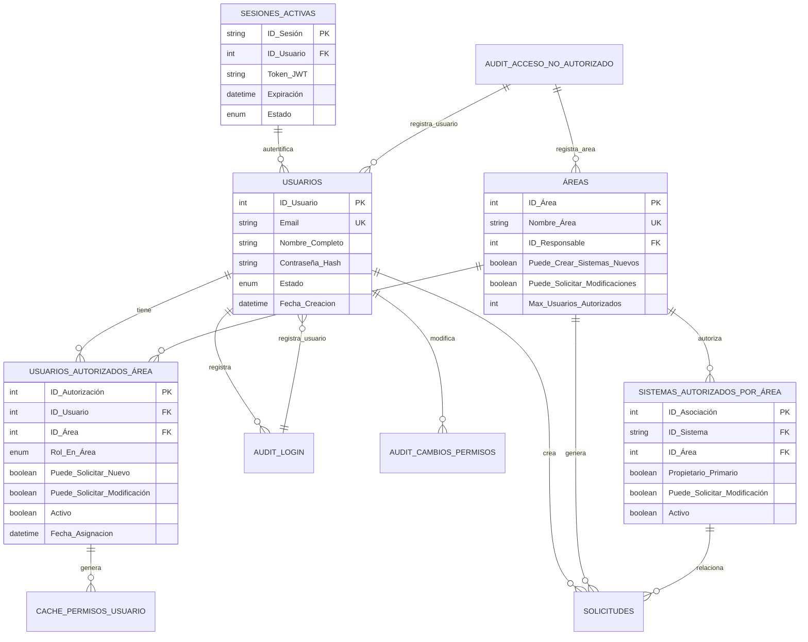

# Sistema de Control de Acceso y Usuarios - Estructura de Base de Datos

## 1. Tablas Principales para Control de Acceso

### 1.1 Tabla: Usuarios

**Descripción:**
- Tabla base de todos los usuarios del sistema
- Email único para evitar duplicados
- Contraseña almacenada en hash (bcrypt, scrypt o Argon2)
- Control de intentos fallidos para prevenir fuerza bruta
- Soporte para autenticación de dos factores

---

### 1.2 Tabla: Áreas (Departamentos)

**Descripción:**
- Define las áreas/departamentos de la institución
- Control de cuántos usuarios autorizados por área
- Permisos a nivel de área (crear sistemas, solicitar modificaciones)

---

### 1.3 Tabla: Usuarios_Autorizados_Área (Asignación de Usuarios a Áreas)

**Descripción:**
- Define qué usuario pertenece a qué área
- Un usuario puede estar en múltiples áreas
- Control granular de permisos por área
- `Puede_Solicitar_Nuevo`: Solo un usuario por área (idealmente)
- `Puede_Solicitar_Modificación`: Múltiples usuarios pueden solicitar cambios
- `Puede_Aprobar_Solicitudes`: ISSEG puede aprobar (no usuarios de área)
- Registro de cuándo se asignó/desasignó

---

### 1.4 Tabla: Sistemas_Autorizados_Por_Área

**Descripción:**
- Define qué sistema está disponible para qué área
- `Propietario_Primario`: Área dueña del sistema
- `Puede_Solicitar_Modificación`: Si el área puede solicitar cambios
- Múltiples áreas pueden usar el mismo sistema
- Control de costos por área y sistema
- SLA acordado específico para la combinación

---

## 2. Tablas de Auditoría y Seguridad

### 2.1 Tabla: Audit_Login

**Descripción:**
- Registro de todos los intentos de login
- Permite detectar accesos sospechosos
- Rastreo de IP y ubicación geográfica
- Base para alertas de seguridad

---

### 2.2 Tabla: Audit_Acceso_No_Autorizado

**Descripción:**
- Registro detallado de intentos de acceso no autorizado
- Auditoría completa para seguridad
- Base para investigaciones de incidentes
- Notificaciones automáticas a administradores

---

### 2.3 Tabla: Audit_Cambios_Permisos

**Descripción:**
- Trazabilidad completa de cambios en permisos
- Quién cambió qué, cuándo y por qué
- Base para auditorías externas
- Cumplimiento normativo

---

## 3. Tabla de Solicitudes con Auditoría de Acceso

---

## 4. Tablas para Validación en Tiempo Real

### 4.1 Tabla: Sesiones_Activas

---

### 4.2 Tabla: Cache_Permisos_Usuario

**Descripción:**
- Cache de permisos para mejorar rendimiento
- Se actualiza cuando cambian permisos o cada cierto tiempo
- Reduce carga de BD en validaciones frecuentes
- TTL configurable para invalidación

---

## 5. Procedimientos Almacenados Importantes

### 5.1 Obtener Permisos Completos del Usuario

---

### 5.2 Obtener Sistemas Visibles para Usuario

---

### 5.3 Registrar Intento de Acceso No Autorizado

---

## 6. Vistas (Views) Útiles

### 6.1 Vista: Usuario_Permisos_Completo

---

### 6.2 Vista: Usuarios_Sin_Autorización

---

## 7. Diagrama ERD Completo - Control de Usuarios



---

## 8. Flujo de Validación en Tiempo Real

```
1. Usuario Intenta Solicitar [Crear Nuevo] o [Modificar]
    ↓
2. Sistema Busca ID_Usuario en USUARIOS
    ↓
3. Si NO EXISTE o INACTIVO → ACCESO DENEGADO
    ↓
4. Si EXISTE y ACTIVO → Buscar en USUARIOS_AUTORIZADOS_ÁREA
    ↓
5. Si NO EXISTE REGISTRO → ACCESO DENEGADO (sin área asignada)
    ↓
6. Si EXISTE → Validar:
    ├─ ¿Activo = TRUE?
    ├─ ¿Puede_Solicitar_Nuevo = TRUE? (para crear sistema)
    ├─ ¿Puede_Solicitar_Modificación = TRUE? (para modificación)
    └─ ¿Area puede hacer la acción? (nivel área)
    ↓
7. Si TODOS CUMPLEN → ACCESO PERMITIDO
    → Cargar sistemas visibles desde SISTEMAS_AUTORIZADOS_POR_ÁREA
    ↓
8. Si ALGUNO FALLA → ACCESO DENEGADO
    → Registrar en AUDIT_ACCESO_NO_AUTORIZADO
    → Notificar administrador si múltiples intentos
```

---

## 9. Configuración Recomendada de Índices

---

## 10. Seguridad Recomendada

1. **Almacenamiento de Contraseñas**
   - Usar Argon2 o bcrypt con salt
   - NUNCA plaintext

2. **Tokens JWT**
   - TTL: 1 hora
   - Refresh token: 7 días
   - Incluir: user_id, área, permisos

3. **Dos Factores (2FA)**
   - Implementar TOTP o SMS
   - Para cuentas privilegiadas (ISSEG)

4. **Rate Limiting**
   - 5 intentos fallidos → bloqueo temporal
   - 10 intentos en 30 min → alerta admin

5. **Audit Trail**
   - Registrar TODOS los cambios
   - Inmutable (append-only logs)
   - Retención: mínimo 2 años

6. **Encriptación en Tránsito**
   - HTTPS/TLS 1.2+ obligatorio
   - Firmar cookies de sesión
