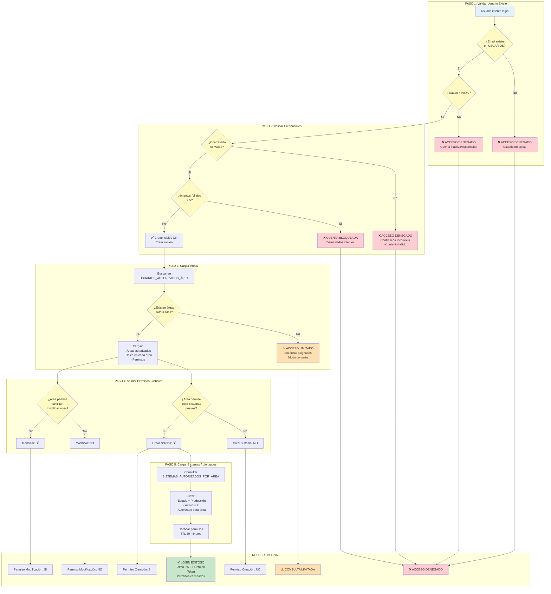
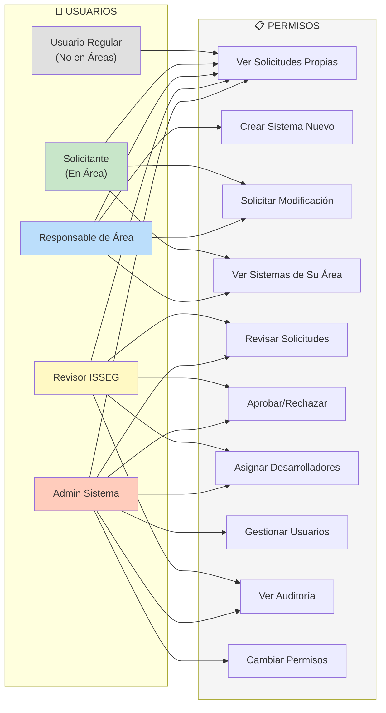
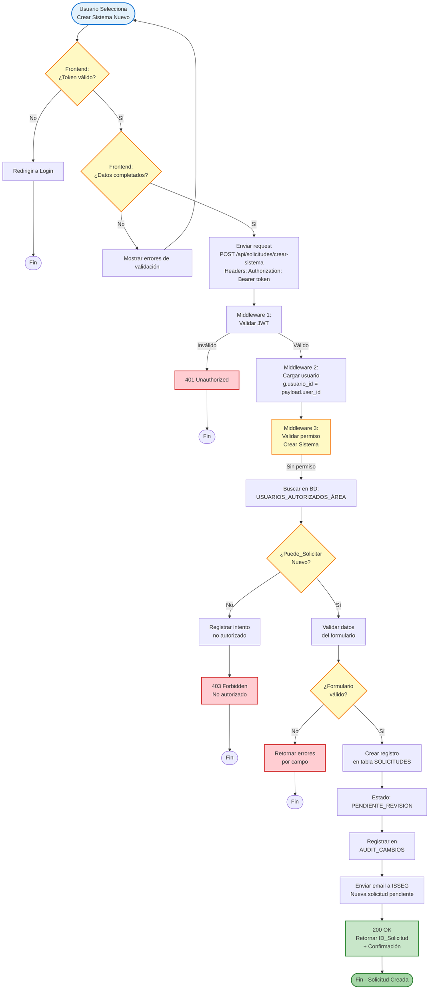
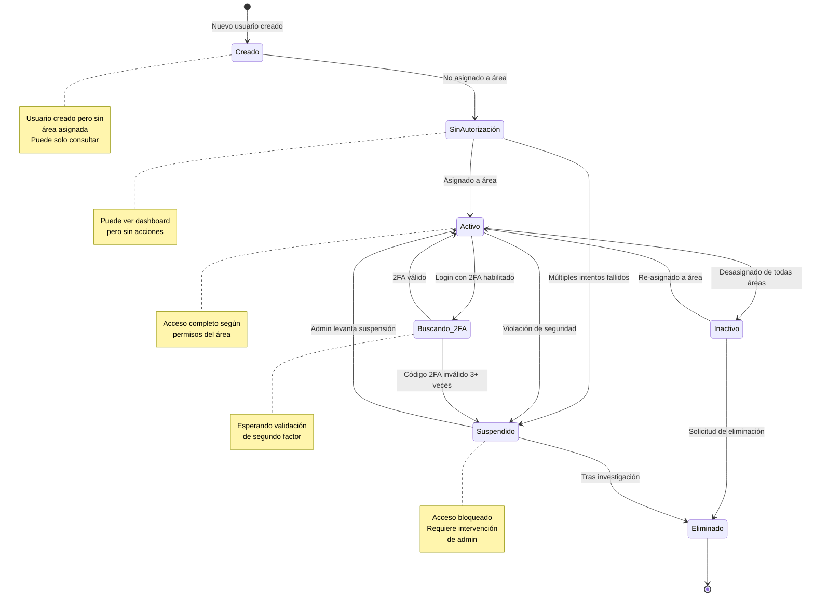
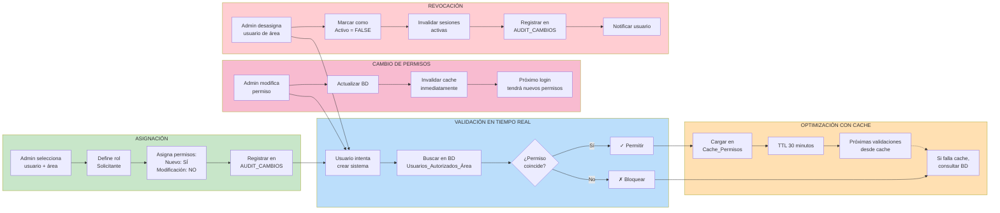
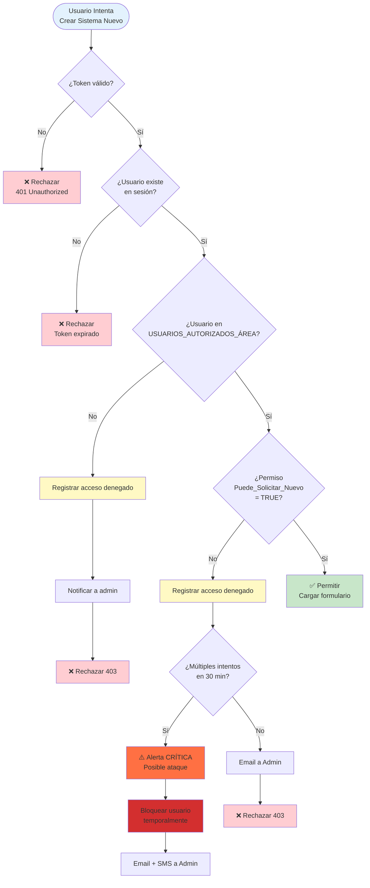
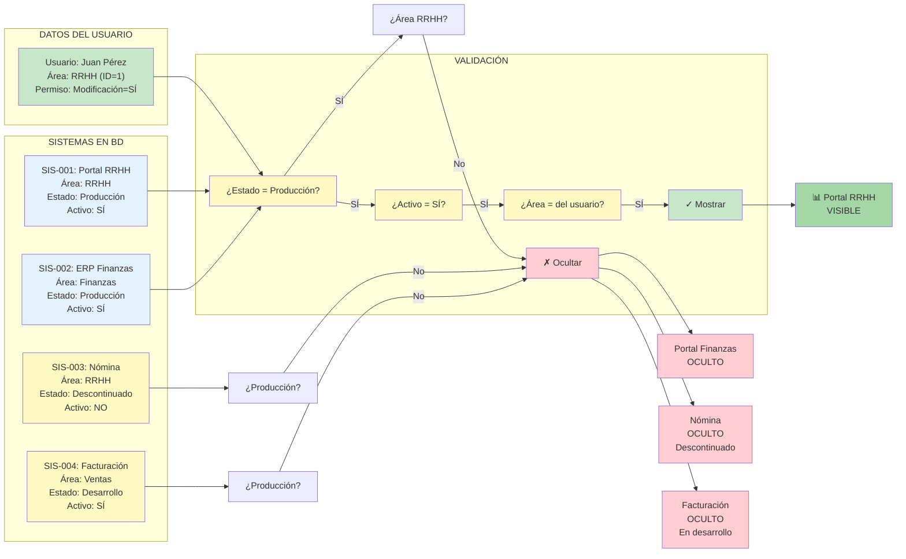
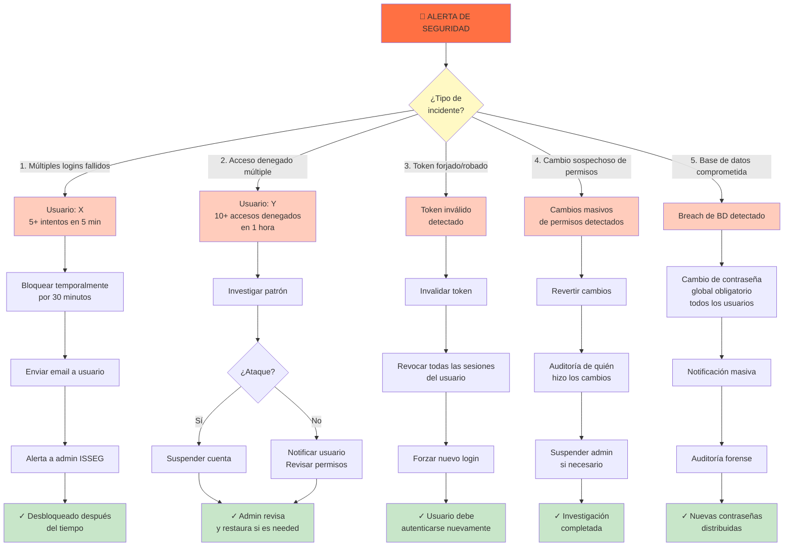

# Diagramas Adicionales - Control de Acceso y Validaciones

## 1. Diagrama Detallado de Validación Multi-Nivel



---

## 2. Diagrama: Matriz de Permisos por Rol



---

## 3. Diagrama: Flujo de Validación de Solicitud



---

## 4. Diagrama: Estados Posibles de un Usuario



---

## 5. Diagrama: Ciclo de Vida de Permisos



---

## 6. Diagrama: Flujo de Seguridad en Login

```mermaid
sequenceDiagram
    actor Usuario
    participant Browser as 🌐 Browser
    participant Frontend as ⚛️ Frontend
    participant API as 🔗 API
    participant DB as 🗄️ Base Datos
    participant Cache as ⚡ Cache Redis
    participant Email as 📧 Email
    participant Audit as 📝 Audit Log
    
    Usuario->>Browser: Abre sistema
    Browser->>Frontend: Muestra formulario login
    
    Usuario->>Frontend: Escribe email/password
    Frontend->>Frontend: Validar formato email
    Frontend->>Frontend: Validar longitud password
    Frontend->>Frontend: Generar CAPTCHA token
    
    Frontend->>API: POST /auth/login<br/>(email, password_hash, captcha)
    
    API->>API: Validar CAPTCHA con Google
    alt CAPTCHA inválido
        API->>API: Registrar intento sospechoso
        API->>Audit: Log: CAPTCHA_FAILED
        API-->>Frontend: 400 Bad Request
    end
    
    API->>DB: Buscar usuario por email
    alt Usuario no existe
        API->>Audit: Log: USER_NOT_FOUND
        API-->>Frontend: 401 Unauthorized
    end
    
    DB-->>API: Retorna usuario (ID, password_hash)
    
    API->>API: Verificar contraseña<br/>(argon2.verify)
    alt Contraseña incorrecta
        API->>DB: UPDATE intentos_fallidos++
        alt intentos_fallidos >= 5
            API->>DB: UPDATE estado = BLOQUEADO
            API->>Email: Enviar alerta bloqueo
            API->>Audit: Log: ACCOUNT_LOCKED
        else
            API->>Audit: Log: LOGIN_FAILED
        end
        API-->>Frontend: 401 Unauthorized
    end
    
    API->>DB: Verificar estado usuario
    alt Estado != ACTIVO
        API->>Audit: Log: ACCOUNT_INACTIVE
        API-->>Frontend: 403 Forbidden
    end
    
    API->>DB: Buscar áreas autorizadas<br/>(USUARIOS_AUTORIZADOS_ÁREA)
    DB-->>API: Retorna áreas con permisos
    
    API->>API: Crear JWT Token<br/>(user_id, email, áreas, exp=1h)
    API->>API: Crear Refresh Token<br/>(user_id, exp=7d)
    
    API->>DB: Registrar sesión<br/>(SESIONES_ACTIVAS)
    API->>Cache: Cachear permisos<br/>(TTL=30min)
    
    API->>Audit: Log: LOGIN_SUCCESS
    API->>Email: Enviar confirmación login
    
    API-->>Frontend: 200 OK<br/>(access_token, refresh_token)
    
    Frontend->>Frontend: Guardar tokens en localStorage
    Frontend->>Frontend: Guardar usuario en contexto
    Frontend->>Browser: Redirigir a /dashboard
    Browser->>Frontend: Cargar dashboard
    
    note over API, Audit
        Toda transacción registrada en Audit
        para trazabilidad completa
    end
```

---

## 7. Diagrama: Intento de Acceso No Autorizado



---

## 8. Tabla: Matriz de Decisiones de Filtrado



---

## 9. Diagrama: Recuperación ante Fallos de Seguridad



Todos estos diagramas muestran en detalle:
1. Validaciones multi-nivel de acceso
2. Estados y transiciones de usuarios
3. Flujos de solicitudes con auditoría
4. Matriz de permisos
5. Ciclo de vida de permisos
6. Seguridad en login (secuencia)
7. Intentos de acceso no autorizado
8. Filtrado de sistemas
9. Recuperación ante incidentes

Puedes visualizarlos en VS Code con Ctrl+Shift+V
