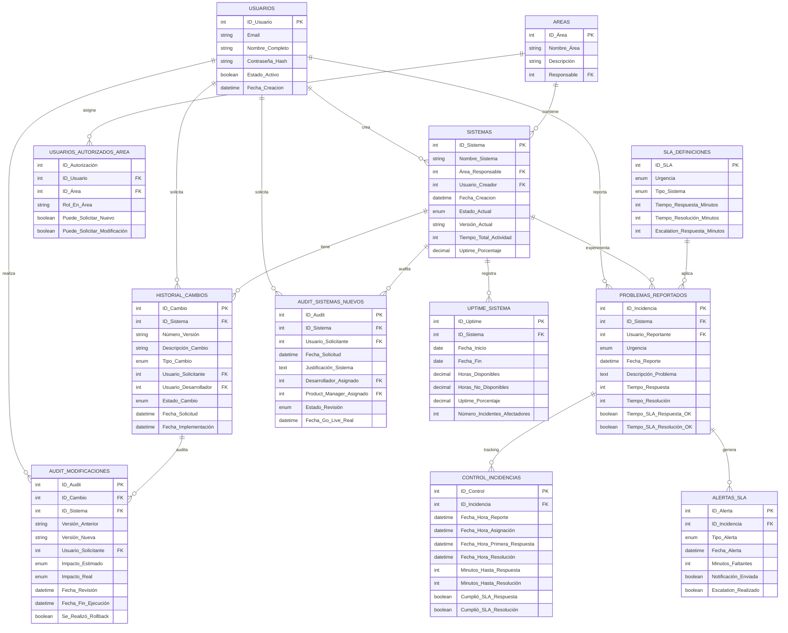

# Diagrama de Tablas - Estructura Completa de Base de Datos

## Relaciones Entre Tablas (ERD)



---

## Tabla Resumen: Propósito y Contenido

| # | Tabla | Propósito | Registros Por | Clave Primaria |
|---|-------|-----------|---------------|---|
| 1 | **Sistemas** | Maestro de todos los sistemas | Sistema | ID_Sistema |
| 2 | **Historial_Cambios** | Control de versiones | Modificación | ID_Cambio |
| 3 | **Problemas_Reportados** | Registro de incidencias | Problema | ID_Incidencia |
| 4 | **Control_Incidencias** | Timeline temporal de SLA | Problema | ID_Control |
| 5 | **Uptime_Sistema** | Disponibilidad periódica | Sistema/Período | ID_Uptime |
| 6 | **Audit_Sistemas_Nuevos** | Auditoría de creación | Sistema nuevo | ID_Audit |
| 7 | **Audit_Modificaciones** | Auditoría de cambios | Modificación | ID_Audit |
| 8 | **SLA_Definiciones** | Políticas de SLA | Urgencia/Tipo | ID_SLA |
| 9 | **Alertas_SLA** | Violaciones de SLA | Violación | ID_Alerta |

---

## Flujo de Datos: Cómo Se Conectan

### CASO 1: CREAR SISTEMA NUEVO

```
USUARIO
  ↓
FORMULARIO A (Sistema Nuevo)
  ↓
ISSEG APRUEBA
  ↓
├─→ TABLA: Sistemas (INSERT nuevo registro)
│   └─→ ID_Sistema = auto_increment
│   └─→ Estado = 'Planeación'
│   └─→ Versión = '1.0'
│
├─→ TABLA: Audit_Sistemas_Nuevos (INSERT auditoría)
│   └─→ Usuario_Solicitante
│   └─→ Equipo_Asignado
│   └─→ Timeline_Estimado
│
└─→ TABLA: Uptime_Sistema (INSERT registro inicial)
    └─→ Fecha_Inicio = HOY
    └─→ Uptime_Porcentaje = 0 (no en producción aún)
```

---

### CASO 2: SOLICITAR MODIFICACIÓN

```
USUARIO
  ↓
ELIGE SISTEMA (filtra por área)
  ↓
FORMULARIO B (Describe cambio)
  ↓
ISSEG APRUEBA
  ↓
├─→ TABLA: Historial_Cambios (INSERT nuevo cambio)
│   └─→ ID_Sistema (FK)
│   └─→ Número_Versión++  (1.0 → 1.1 o 1.0 → 2.0)
│   └─→ Descripción_Cambio
│   └─→ Estado = 'En Desarrollo'
│
├─→ TABLA: Audit_Modificaciones (INSERT auditoría)
│   └─→ Versión_Anterior
│   └─→ Versión_Nueva
│   └─→ Impacto_Estimado vs Impacto_Real
│   └─→ Rollback posible: SÍ
│
└─→ TABLA: Sistemas (UPDATE)
    └─→ Versión_Actual = nueva versión
    └─→ Última_Actualización = HOY
```

---

### CASO 3: REPORTAR PROBLEMA

```
USUARIO
  ↓
ELIGE SISTEMA (filtra por área)
  ↓
FORMULARIO PROBLEMA
  ├─ Descripción
  ├─ Urgencia: Crítica/Alta/Media/Baja
  └─ Pasos reproducir
  ↓
ISSEG APRUEBA
  ↓
├─→ TABLA: SLA_Definiciones (LOOKUP)
│   └─→ SELECT * WHERE Urgencia = 'Crítica'
│   └─→ Tiempo_Respuesta = 60 minutos
│   └─→ Tiempo_Resolución = 240 minutos (4 horas)
│
├─→ TABLA: Problemas_Reportados (INSERT incidencia)
│   └─→ ID_Incidencia = auto_increment
│   └─→ Urgencia = 'Crítica'
│   └─→ Fecha_Límite_Respuesta = NOW() + 60 min
│   └─→ Fecha_Límite_Resolución = NOW() + 240 min
│   └─→ Estado = 'Abierto'
│
├─→ TABLA: Control_Incidencias (INSERT timeline)
│   └─→ Fecha_Hora_Reporte = NOW()
│   └─→ Tiempo_Respuesta = 0
│   └─→ Tiempo_Resolución = 0
│   └─→ Cumplió_SLA = pendiente
│
└─→ TABLA: Alertas_SLA (INSERT alerta inicial)
    └─→ Tipo_Alerta = 'Alerta Respuesta'
    └─→ Minutos_Faltantes = 60
```

**DURANTE EL PROCESO:**

```
DESARROLLADOR INICIA INVESTIGACIÓN
  ↓
TABLA: Control_Incidencias (UPDATE)
  └─→ Fecha_Hora_Primera_Respuesta = NOW()
  └─→ Minutos_Hasta_Respuesta = DATEDIFF(NOW(), Fecha_Reporte)
  └─→ ¿Cumplió SLA Respuesta? CALCULAR
  └─→ Si NO → TABLA: Alertas_SLA (INSERT CRÍTICA)

DESARROLLADOR ENCUENTRA SOLUCIÓN
  ↓
TABLA: Problemas_Reportados (UPDATE)
  └─→ Solución_Implementada = "texto de solución"
  └─→ Causa_Raíz = "causa identificada"
  └─→ Estado = 'Solución Implementada'

SOLUCIÓN IMPLEMENTADA Y PROBADA
  ↓
TABLA: Control_Incidencias (UPDATE)
  └─→ Fecha_Hora_Resolución = NOW()
  └─→ Minutos_Hasta_Resolución = DATEDIFF(NOW(), Fecha_Reporte)
  └─→ ¿Cumplió SLA Resolución? CALCULAR

CERRAR INCIDENCIA
  ↓
TABLA: Problemas_Reportados (UPDATE)
  └─→ Estado = 'Cerrado'
  └─→ Fecha_Cierre = NOW()
  └─→ Feedback_Usuario = "¿Satisfecho?"
  └─→ Satisfacción = 1-5 estrellas

TABLA: Control_Incidencias (UPDATE FINAL)
  └─→ Cumplió_SLA_Respuesta = YES/NO
  └─→ Cumplió_SLA_Resolución = YES/NO
  └─→ Número_Reaperturas = ¿Fue reabierto?
```

---

## Ejemplos de Consultas Comunes

### 1. ¿Cuál es el estado actual de cada sistema?

**Respuesta en columnas:**
- Sistema A: En Producción, v2.3.1, 99.5% uptime
- Sistema B: En Desarrollo, v1.0.0, 0% (nuevo)

---

### 2. ¿Qué modificaciones se hicieron a un sistema?

**Respuesta:**
- v2.3.1: "Bugfix - Error en reporte mensual" - 2026-02-01
- v2.3.0: "Feature - Agregar filtro por fecha" - 2026-01-20

---

### 3. ¿Incidencias sin resolver con SLA crítico?

---

### 4. ¿Desempeño de SLA del mes?

---

### 5. ¿Uptime mensual de sistema específico?

---

## Índices Críticos Creados

---

## Capacidad de Base de Datos (Estimaciones)

| Tabla | Registros Año 1 | Tamaño Estimado |
|-------|-----------------|-----------------|
| Sistemas | 50 | 50 KB |
| Historial_Cambios | 500 | 100 KB |
| Problemas_Reportados | 2000 | 200 KB |
| Control_Incidencias | 2000 | 150 KB |
| Uptime_Sistema | 1800 | 100 KB |
| Audit_Sistemas_Nuevos | 50 | 50 KB |
| Audit_Modificaciones | 500 | 100 KB |
| SLA_Definiciones | 4 | 5 KB |
| Alertas_SLA | 500 | 50 KB |
| **TOTAL** | **7,404** | **~800 KB** |

---

**Estado:** ✅ Listo para SQL execution  
**Siguiente paso:** Ejecutar scripts SQL en base de datos destino
