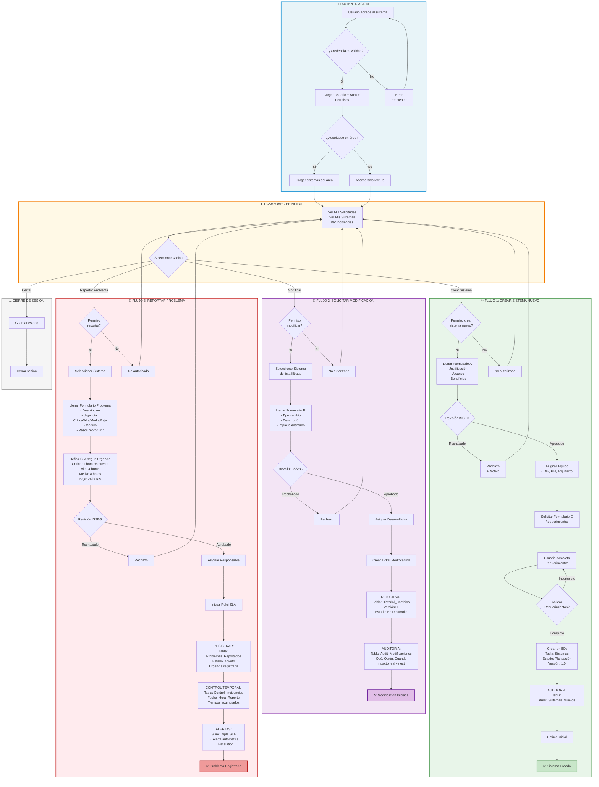

# Visualización Completa: 3 Flujos Integrados en un Solo Diagrama

## Mapa Visual: Sistema de Gestión Completo



---

## Vista Secuencial: ¿Qué Tabla Se Usa Cuándo?

### CREAR SISTEMA NUEVO

```
Paso 1: Usuario envía Formulario A
        ↓
Paso 2: ISSEG aprueba
        ↓
Paso 3: CREAR REGISTROS EN BD:
        
    3a. INSERT INTO Sistemas
        - ID_Sistema = 101
        - Nombre_Sistema = "Portal RH"
        - Estado_Actual = "Planeación"
        - Versión_Actual = "1.0"
        - Área_Responsable = 3
        - Usuario_Creador = 45
        
    3b. INSERT INTO Audit_Sistemas_Nuevos
        - Usuario_Solicitante = 45
        - Fecha_Solicitud = HOY
        - Justificación_Sistema = "texto..."
        - Equipo_Asignado = "Dev#1, PM#2, Arq#3"
        
    3c. INSERT INTO Uptime_Sistema
        - ID_Sistema = 101
        - Fecha_Inicio = HOY
        - Uptime_Porcentaje = 0 (nuevo, no en prod)
        
Paso 4: Sistema automáticamente:
        - Muestra ID_Sistema = 101
        - Asigna Versión = 1.0
        - Abre ticket en ISSEG
```

---

### SOLICITAR MODIFICACIÓN

```
Paso 1: Usuario selecciona Sistema (ej: ID=50)
        ↓
Paso 2: Usuario envía Formulario B
        ↓
Paso 3: ISSEG aprueba
        ↓
Paso 4: CREAR/ACTUALIZAR EN BD:

    4a. INSERT INTO Historial_Cambios
        - ID_Cambio = 1501
        - ID_Sistema = 50
        - Número_Versión = "2.3.1" (fue 2.3.0)
        - Descripción_Cambio = "Bugfix: error en reporte"
        - Tipo_Cambio = "Bugfix"
        - Estado_Cambio = "En Desarrollo"
        
    4b. UPDATE Sistemas
        WHERE ID_Sistema = 50
        SET Versión_Actual = "2.3.1",
            Última_Actualización = NOW()
        
    4c. INSERT INTO Audit_Modificaciones
        - ID_Cambio = 1501
        - Versión_Anterior = "2.3.0"
        - Versión_Nueva = "2.3.1"
        - Impacto_Estimado = "Bajo"
        - Usuario_Solicitante = 45
        
Paso 5: Desarrollador comienza trabajo
        - Tabla: Historial_Cambios.Estado_Cambio = "En Desarrollo"
        
Paso 6: Trabajo finaliza, se prueba
        - Tabla: Audit_Modificaciones.Resultado_Testing = "Pasó"
        
Paso 7: Cambio implementado
        - Tabla: Historial_Cambios.Estado_Cambio = "Implementado"
        - Tabla: Historial_Cambios.Fecha_Implementación = NOW()
        - Tabla: Sistemas.Versión_Actual = "2.3.1" (confirmado)
```

---

### REPORTAR PROBLEMA

```
Paso 1: Usuario selecciona Sistema (ej: ID=50)
        ↓
Paso 2: Usuario envía Formulario Problema
        ↓
Paso 3: Sistema determina Urgencia
        
    3a. LOOKUP en SLA_Definiciones
        SELECT * WHERE Urgencia = "Crítica"
        → Tiempo_Respuesta = 60 minutos
        → Tiempo_Resolución = 240 minutos
        
Paso 4: ISSEG aprueba
        ↓
Paso 5: CREAR REGISTROS EN BD:

    5a. INSERT INTO Problemas_Reportados
        - ID_Incidencia = 8501
        - ID_Sistema = 50
        - Usuario_Reportante = 45
        - Urgencia = "Crítica"
        - Fecha_Reporte = NOW()
        - Fecha_Límite_Respuesta = NOW() + 60 min
        - Fecha_Límite_Resolución = NOW() + 240 min
        - Estado_Actual = "Abierto"
        - Responsable_Asignado = 78
        
    5b. INSERT INTO Control_Incidencias
        - ID_Incidencia = 8501
        - Fecha_Hora_Reporte = NOW()
        - Minutos_Hasta_Respuesta = 0
        - Minutos_Hasta_Resolución = 0
        - Cumplió_SLA_Respuesta = false (pendiente)
        
    5c. INSERT INTO Alertas_SLA
        - ID_Incidencia = 8501
        - Tipo_Alerta = "Alerta Respuesta"
        - Minutos_Faltantes = 60

Paso 6: DURANTE investigación:

    6a. UPDATE Problemas_Reportados
        SET Estado_Actual = "En Investigación"
        
    6b. UPDATE Control_Incidencias
        SET Fecha_Hora_Primera_Respuesta = NOW()
        SET Minutos_Hasta_Respuesta = DATEDIFF(NOW(), Fecha_Reporte)
        SET Cumplió_SLA_Respuesta = IF(Minutos < 60, true, false)
        
    6c. Si SLA incumplido:
        UPDATE Alertas_SLA
        SET Tipo_Alerta = "Crítica Respuesta"
        SET Escalation_Realizado = true

Paso 7: SOLUCIONADO:

    7a. UPDATE Problemas_Reportados
        SET Solución_Implementada = "texto solución"
        SET Causa_Raíz = "causa identificada"
        SET Estado_Actual = "Solución Implementada"
        
    7b. UPDATE Control_Incidencias
        SET Fecha_Hora_Resolución = NOW()
        SET Minutos_Hasta_Resolución = DATEDIFF(NOW(), Fecha_Reporte)
        SET Cumplió_SLA_Resolución = IF(Minutos < 240, true, false)

Paso 8: CERRADO:

    8a. UPDATE Problemas_Reportados
        SET Estado_Actual = "Cerrado"
        SET Fecha_Cierre = NOW()
        SET Feedback_Usuario = "¿Satisfecho?"
        SET Satisfacción = 5  (1-5 estrellas)
```

---

## Dashboard de Control: ¿Qué Ve Cada Usuario?

### Usuario ÁREA (RRHH)

```
Mi Dashboard:
├─ Mis Solicitudes
│  ├─ Sistemas Nuevo: 2 (1 Planeación, 1 Desarrollo)
│  ├─ Modificaciones: 5 (3 En Desarrollo, 2 Implementadas)
│  └─ Problemas: 12 (4 Abiertos, 8 Cerrados)
├─ Mis Sistemas (filtrado por área)
│  ├─ Portal RRHH (v1.2.3, 99.8% uptime)
│  ├─ Nómina (v2.1.0, 99.2% uptime)
│  └─ Bonificaciones (v1.0.0, nuevo)
└─ Incidencias Críticas Abiertas
   └─ 0 críticas, 1 alta (4h, 2h restantes)
```

### ISSEG (Revisor)

```
Panel ISSEG:
├─ Solicitudes Pendientes Revisión: 8
│  ├─ Sistemas Nuevos: 3
│  ├─ Modificaciones: 3
│  └─ Problemas: 2
├─ Todas las Incidencias Críticas
│  ├─ Abiertas: 5 (monitor tiempo)
│  ├─ SLA Incumplidos: 2 ⚠️
│  └─ Escalations Activas: 1
├─ Métricas SLA Mensuales
│  ├─ Respuesta OK: 94%
│  └─ Resolución OK: 89%
└─ Cambios en Implementación
   └─ Hoy: 3 cambios implementados
```

### Desarrollador

```
Mi Panel:
├─ Tareas Asignadas
│  ├─ Modificaciones: 4 (2 En Desarrollo, 1 En Pruebas, 1 Testing)
│  ├─ Problemas Críticos: 1 (3h abierto)
│  └─ Nuevos Sistemas: 1 (Requerimientos pendientes)
├─ Cambios en Progreso
│  └─ Versiones trabajando: 3
└─ Incidencias Asignadas a Mí
   └─ Urgencia Crítica: 1 (1h 30m para responder)
```

---

## Tabla de Transiciones de Estado

### Estados: Sistema Nuevo

```
Planeación → En Desarrollo → En Pruebas → En Producción → Mantenimiento → Descontinuado
    ↑                                                                              ↓
    └──────────────────── (rollback/cancelación) ←─────────────────────────────────┘
```

### Estados: Modificación

```
Solicitado → En Desarrollo → En Pruebas → Aprobado → Implementado
    ↑                                        ↓
    └────────────────────── Rechazado ──────┘
```

### Estados: Problema

```
Abierto → En Investigación → Causa Identificada → Solución En Progreso → Implementada → Cerrado
    ↑                                                                           ↓
    └───────────────────────────── Reabierto ←─────────────────────────────────┘
```

---

## Alertas Automáticas

| Evento | Tabla | Acción |
|--------|-------|--------|
| **SLA Respuesta a 50%** | Control_Incidencias + Alertas_SLA | Email al responsable |
| **SLA Respuesta incumplido** | Control_Incidencias + Alertas_SLA | Escalation a manager |
| **SLA Resolución a 75%** | Control_Incidencias + Alertas_SLA | Email crítico |
| **SLA Resolución incumplido** | Control_Incidencias + Alertas_SLA | Escalation a VP |
| **Cambio listo para implementar** | Historial_Cambios | Notificar Team Lead |
| **Sistema sin actividad 30 días** | Sistemas | Alerta de inactividad |

---

## Conclusión: Flujo Completo en Paralelo

```
USUARIO ENTRA
    ↓
AUTENTICA Y CARGA PERMISOS
    ↓
VE DASHBOARD
    ├─ Crear Sistema Nuevo ────→ [FC] ISSEG → BD → Auditoría → Crear Sistema
    ├─ Modificar Existente ─────→ [FM] ISSEG → BD → Auditoría → Incrementar Versión
    └─ Reportar Problema ───────→ [FP] ISSEG → BD → SLA → Control → Alertas
    
PARALELAMENTE:
    ├─ Desarrolladores trabajan en tareas
    ├─ Sistemas monitorean uptime
    ├─ Alertas SLA se activan automáticamente
    └─ Auditoría registra todo
```

**TODO REGISTRADO, TODO AUDITADO, TODO BAJO CONTROL.**
